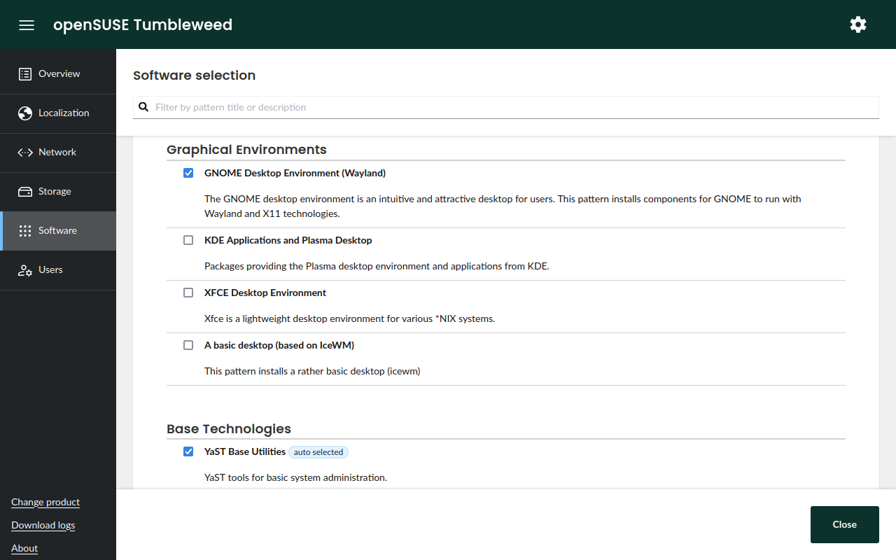

# Agama: A Service-based Linux Installer

Agama is a new Linux installer born in the core of the YaST team. It is designed to offer
re-usability, integration with third party tools and the possibility of building advanced user
interfaces over it.

|                                                                      |                                                                 |
| -------------------------------------------------------------------- | --------------------------------------------------------------- |
|  |  |

Click to show/hide more screenshots

---

|                                                              |                                                                |
| ------------------------------------------------------------ | -------------------------------------------------------------- |
|  |  |

|                                                        |                                                                 |
| ------------------------------------------------------ | --------------------------------------------------------------- |
|  |  |

## Running Agama

The easiest way to give Agama a try is to grab a live ISO image and boot it in a virtual machine.
This is also the recommended way if you only want to play and see it in action. If you want to have
a closer look, then clone and configure the project as explained in the next section.

You can download the ISO from the
[openSUSE Build Service](https://download.opensuse.org/repositories/systemsmanagement:/Agama:/Devel/images/iso/).

> [!NOTE]
> Make sure to download the correct ISO file according to your system architecture (eg. you would
> need to choose a file including `x86_64` if you use an Intel or AMD 64-bit processor).

## Other Resources

- If you want to know how Agama works, you should read about
  [Agama's architecture](/doc/architecture.md)
- If you would like to [contribute](#how-to-contribute), you might be interested in:
  - [Running Agama from sources](./doc/running.md).
  - [Working with Agama's web server](./rust/WEB-SERVER.md).
  - [Working with Agama's web UI](./web/README.md).
- You can check the overall status of the project through the [status page](/STATUS.md).

## How to Contribute

If you want to contribute to Agama, then please open a pull request or report an issue. You can also
get involved in [our discussions](https://github.com/openSUSE/agama/discussions).

For more details, please read the [contributing](CONTRIBUTING.md) guidelines.
