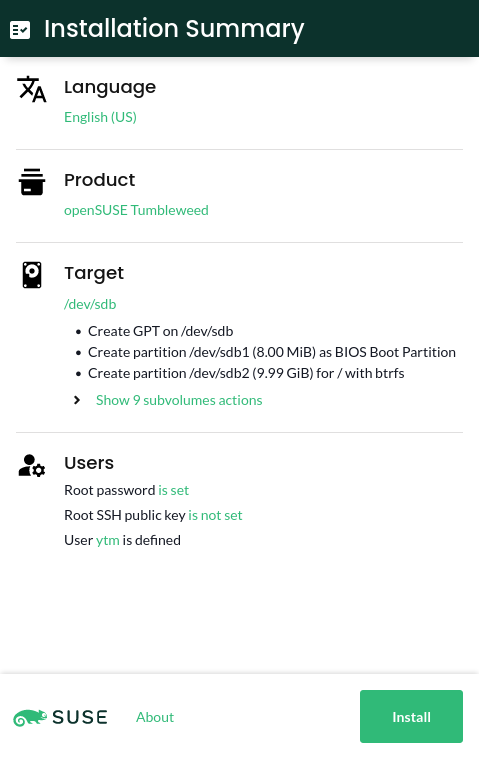
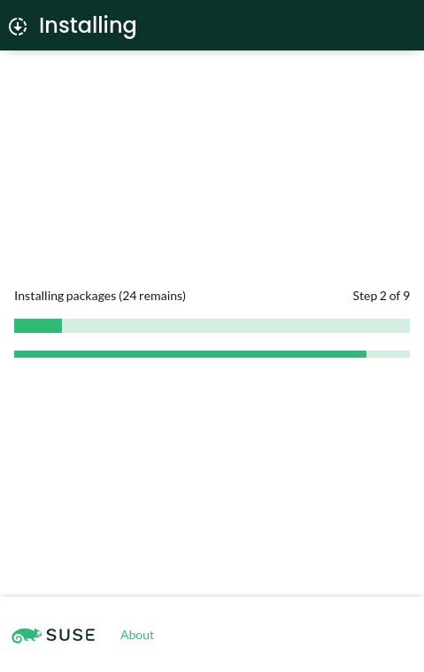
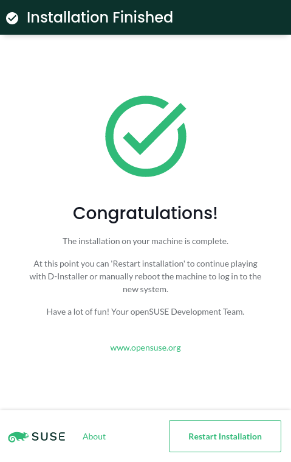

# Service-based experimental installer

The idea of this repository is to build a proof-of-concept of a Linux installer that runs as a
service. At first sight, we have identified these components:

* A YaST-based library that performs the system installation. It represents the installer itself and
  it features an API to query and set installation options (product to install, disk, etc.).
* A [D-Bus](https://www.freedesktop.org/wiki/Software/dbus/) service that exposes the installer's
  API.
* A user interface. We decided to use [Cockpit's infrastructure](https://cockpit-project.org/) to
  communicate the UI with the D-Bus service.

  ||||
  |-|-|-|
  | | |  |

## Quickstart

:warning: **This is a proof-of-concept. Please, use a virtual machine to give it a try.** :warning:

The easiest way to give D-Installer a try is to install the
[rubygem-d-installer](https://build.opensuse.org/package/show/YaST:Head:D-Installer/rubygem-d-installer)
and
[d-installer-web](https://build.opensuse.org/package/show/YaST:Head:D-Installer/d-installer-web)
packages in an [openSUSE Tumbleweed Live
image](https://get.opensuse.org/tumbleweed).

You need to perform some additional steps, like starting the Cockpit service or setting a password
for the "linux" user. However, the repository contains [a script](./deploy.sh) that takes care of
everything. So after booting the image, just type:

    wget https://raw.githubusercontent.com/yast/the-installer/master/deploy.sh
    # inspect content to ensure that nothing malicious is done there
    sh deploy.sh

This process may take a while. Use `linux`/`linux` when the browser opens the log in form.

## Setup

If you want to contribute to the project or just have a closer look, you can run D-Installer from
sources. The first step should be to install Git (if it is not already installed) and clone the
repository:

    sudo zypper --non-interactive in git
    git clone https://github.com/yast/d-installer
    cd d-installer

If you want to save some time, run the [setup.sh script](./setup.sh) and follow the instructions at
the end. Alternatively, just go through the following process if you want to do it manually.

### Dependencies

To build and run this software, you need a few tools. To install them on openSUSE Tumbleweed just
type:

    sudo zypper in gcc gcc-c++ make openssl-devel ruby-devel augeas-devel npm cockpit

The user interface uses Cockpit infrastructure to interact with the D-Bus interface, so you
need to make sure that the `cockpit` service is running:

    sudo systemctl start cockpit

### Running the `d-installer` service

`d-installer` is a YaST-based service that is able to install a system. You can interact with that
service using the D-Bus interface it provides.

Beware that `d-installer` must run as root (like YaST does) to do hardware probing, partition the
disks, install the software and so on. So you need to tell dbus about the service by copying
`service/share/dbus.conf` to `/usr/share/dbus-1/system.d/org.opensuse.DInstaller.conf`.

To run the service, type:

    cd service
    bundle install
    sudo bundle exec bin/d-installer

To check that `d-installer` is working, you can use a tool like
[busctl](https://www.freedesktop.org/wiki/Software/dbus/) (or
[D-Feet](https://wiki.gnome.org/Apps/DFeet)) if you prefer a graphical one:

    busctl call org.opensuse.DInstaller /org/opensuse/DInstaller/Language1 \
      org.opensuse.DInstaller.Language1 AvailableLanguages

If you want to get the properties, just type:

    busctl call org.opensuse.DInstaller /org/opensuse/DInstaller/Language1 \
      org.freedesktop.DBus.Properties GetAll s org.opensuse.DInstaller.Language1

### Starting the web-based user interface

The current UI is a small web application built with [React](https://reactjs.org/). On production it
is meant to be served by `cockpit-ws` from a directory in `XDG_DATA_DIRS` (e.g.,
`/usr/share/cockpit/static/installer`). Building the code might time some time, so there is a
*development mode* available that reloads the code every time it changes.

### Development mode

It allows to set a few installation parameters and start the installation (not implemented yet).

    cd web
    npm install
    npm run dev

Point your browser to http://localhost:3000 and happy hacking!

### Production-like mode

    cd web
    npm run build
    sudo mkdir /usr/share/cockpit/static/installer
    sudo mount -o bind dist /usr/share/cockpit/static/installer

Point your browser to http://localhost:9090/cockpit/static/installer/index.html and enjoy!

## References

* [Development Notes](./DEVELOPMENT.md)
