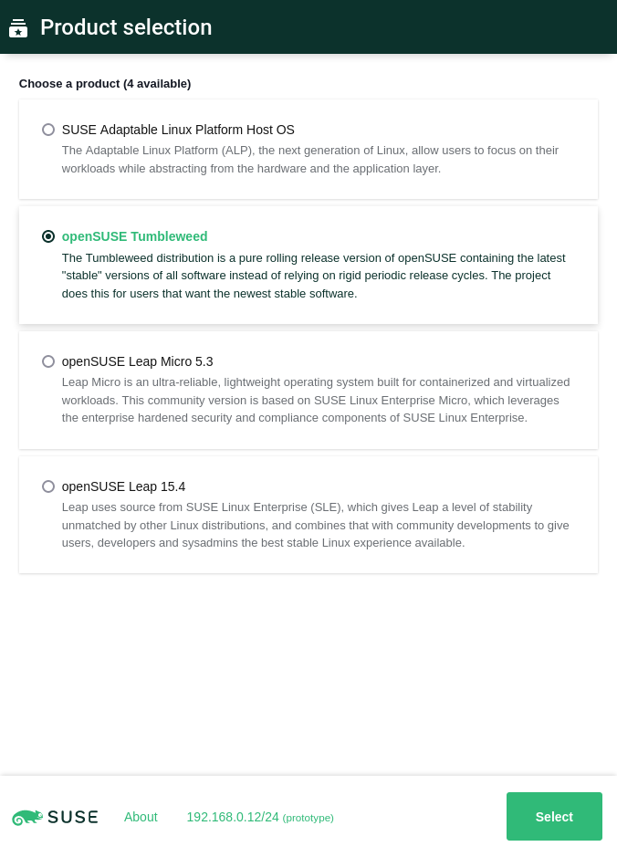
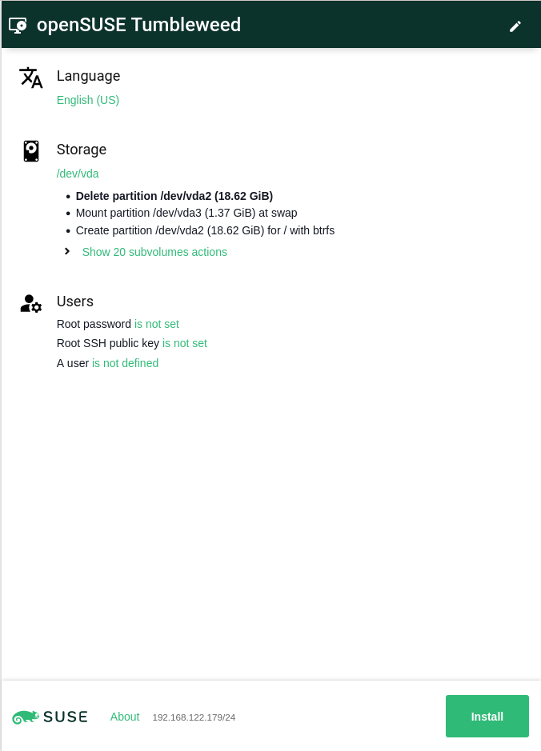
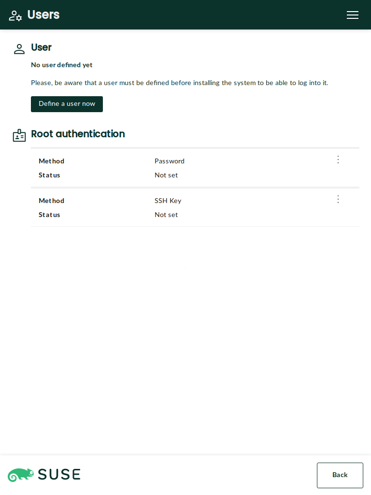
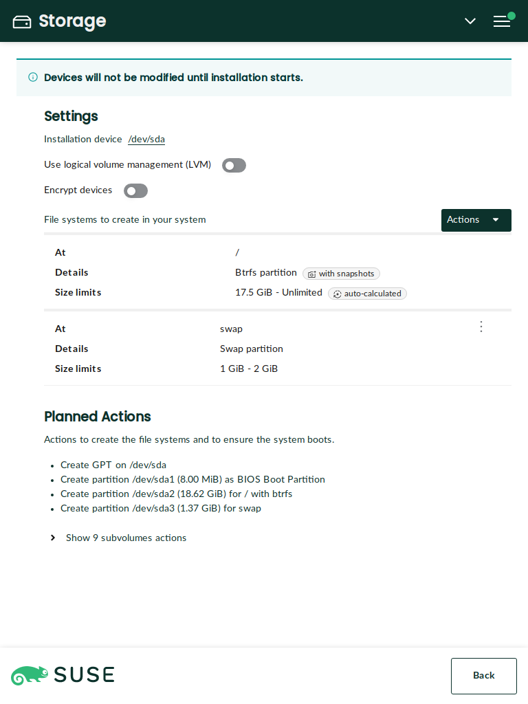
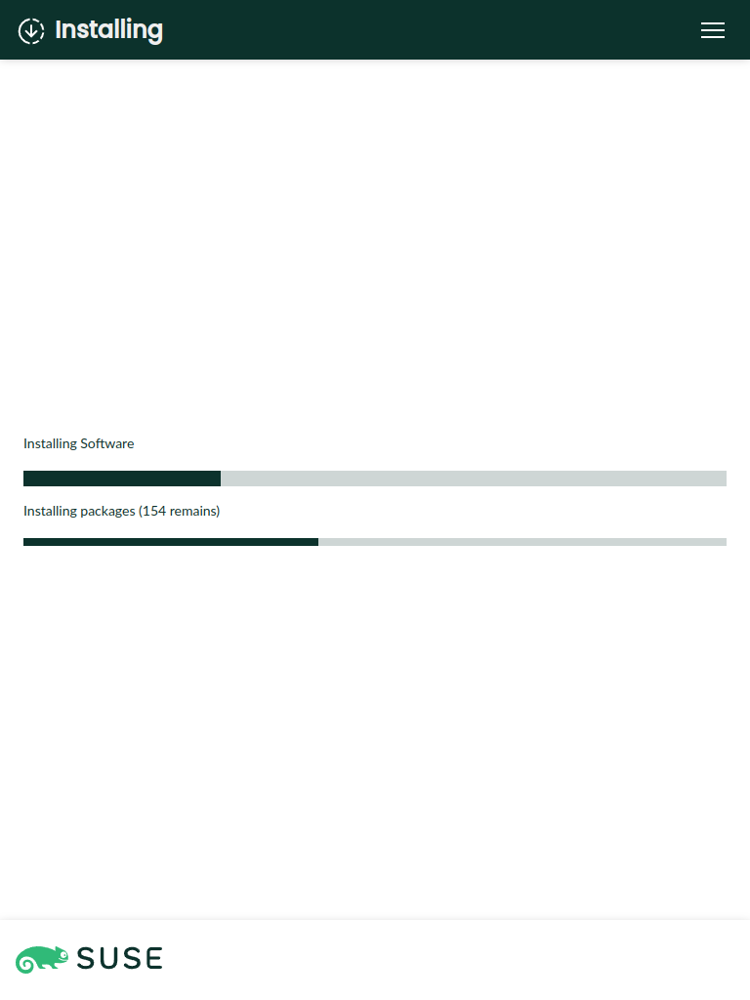
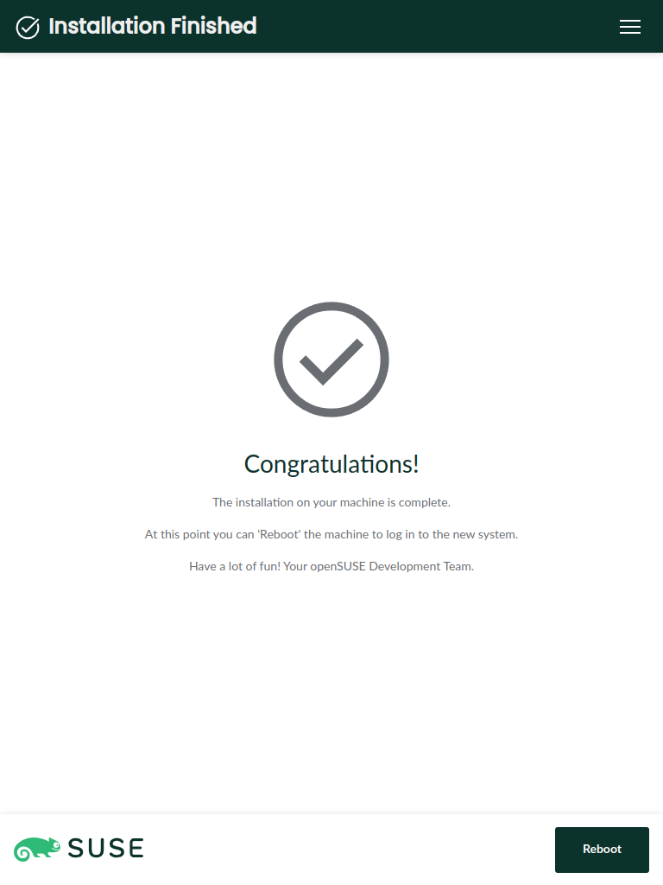
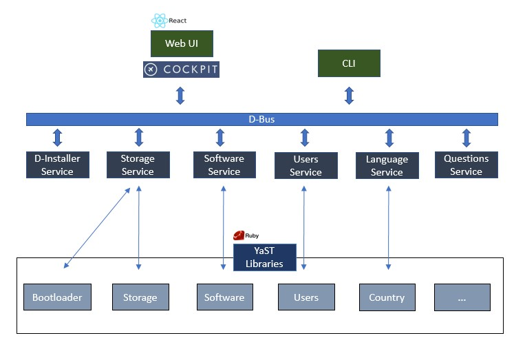

**Checks**

[](https://github.com/openSUSE/agama/actions/workflows/ci-rust.yml)
[](https://github.com/openSUSE/agama/actions/workflows/ci-service.yml)
[](https://github.com/openSUSE/agama/actions/workflows/ci-web.yml)
[](https://github.com/openSUSE/agama/actions/workflows/ci-rubocop.yml)
[](https://github.com/openSUSE/agama/actions/workflows/ci-doc-check.yml)
[](https://github.com/openSUSE/agama/actions/workflows/ci-integration-tests.yml)
[](https://coveralls.io/github/openSUSE/agama?branch=master)
[](https://github.com/openSUSE/agama/actions/workflows/github-pages.yml)

**Translations**

[](https://github.com/openSUSE/agama/actions/workflows/weblate-update-pot.yml)
[](https://github.com/openSUSE/agama/actions/workflows/weblate-merge-po.yml)
[](https://github.com/openSUSE/agama/actions/workflows/weblate-merge-products-po.yml)
[](https://l10n.opensuse.org/engage/agama/)

**[OBS systemsmanagement:Agama:Staging](https://build.opensuse.org/project/show/systemsmanagement:Agama:Staging)**

[](https://github.com/openSUSE/agama/actions/workflows/obs-staging-rust.yml)
[](https://github.com/openSUSE/agama/actions/workflows/obs-staging-web.yml)
[](https://github.com/openSUSE/agama/actions/workflows/obs-staging-service.yml)
[](https://github.com/openSUSE/agama/actions/workflows/obs-staging-playwright.yml)

[](https://build.opensuse.org/package/show/systemsmanagement:Agama:Staging/agama-cli)
[](https://build.opensuse.org/package/show/systemsmanagement:Agama:Staging/cockpit-agama)
[](https://build.opensuse.org/package/show/systemsmanagement:Agama:Staging/rubygem-agama)
[](https://build.opensuse.org/package/show/systemsmanagement:Agama:Staging/agama-products-opensuse)
[](https://build.opensuse.org/package/show/systemsmanagement:Agama:Staging/cockpit-agama-playwright)
[](https://build.opensuse.org/package/show/systemsmanagement:Agama:Staging/agama-live)

**[OBS systemsmanagement:Agama:Devel](https://build.opensuse.org/project/show/systemsmanagement:Agama:Devel)**


[](https://github.com/openSUSE/agama/actions/workflows/obs-release.yml)

[](https://build.opensuse.org/package/show/systemsmanagement:Agama:Devel/agama-cli)
[](https://build.opensuse.org/package/show/systemsmanagement:Agama:Devel/cockpit-agama)
[](https://build.opensuse.org/package/show/systemsmanagement:Agama:Devel/rubygem-agama)
[](https://build.opensuse.org/package/show/systemsmanagement:Agama:Devel/agama-live)

# Agama: A Service-based Linux Installer

Agama is a new Linux installer born in the core of the YaST team. It is designed to offer re-usability, integration with third party tools and the possibility of building advanced user interfaces over it.

|||
|-|-|
|  |  |

<details>
<summary>Click to show/hide more screenshots</summary>

---


|||
|-|-|
|  |  |

|||
|-|-|
|  |  |

*Note for developers: For updating the screenshots see the
[integration test documentation](playwright/README.md#updating-the-screenshots).*

</details>

## Table of Content

* [Why a New Installer](#why-a-new-installer)
* [Architecture](#architecture)
* [How to Run](#how-to-run)
  * [Live ISO Image](#live-iso-image)
    * [Avahi/mDNS](#avahimdns)
  * [Manual Configuration](#manual-configuration)
* [How to Contribute](#how-to-contribute)
* [Development Notes](#development-notes)

## Why a New Installer

This new project follows two main motivations: to overcome some of the limitations of YaST and to serve as installer for new projects like SUSE ALP (Adaptable Linux Platform).

YaST is a mature installer and control center for SUSE and openSUSE operating systems. With more than 20 years behind it, YaST is a competent and flexible installer able to cover uncountable use cases. But time goes by, and the good old YaST is starting to show its age in some aspects:

* The architecture of YaST is complex and its code-base has too much technical debt.
* Designing and building rich and modern user interfaces is a real challenge.
* Sharing logic with other tools like Salt or Ansible is very difficult.
* Some in-house solutions like libyui makes more difficult to contribute to the project.

SUSE is working on its next generation operating system called ALP (Adaptable Linux Platform). ALP is designed to be a lean core system, moving most of the software and workloads to containers and virtual machines. For some cases, for example cloud and virtual machines, ALP based systems will be deployed with auto-installable images. But still there are quite some situations in which ALP must be installed in a more traditional way. A clear example consists on installing over bare metal where some system analysis is required beforehand. Agama is also intended to cover such use cases for ALP, offering a minimal but powerful installer able to support a wide range of scenarios (e.g., RAID, encryption, LVM, network storage, etc).

## Architecture

This project is designed as a service-client system, using a dedicated D-Bus server for process
communication.



Agama consists on a set of D-Bus services, a web client and a command-line interface. The services use YaST-based libraries under the hood, reusing a lot logic already provided by YaST. Currently Agama comes with six separate services, although the list can increase in the future:

* Agama service: it is the main service which manages and controls the installation process.
* Software service: configures the product and software to install.
* Users service: manages first user creation and configuration for root.
* Localization service: allows to configure the language and keyboard settings.
* Storage service: analyzes and prepares the storage devices in order to perform the installation.
* Questions service: helper service used for requesting information from clients.

Agama offers a web interface and its UI process uses the [Cockpit's infrastructure](https://cockpit-project.org/) to communicate with the D-Bus services.

## How to run

There are two ways of running this project: a) by using a Agama live ISO image or b) by cloning and configuring the project.

### Live ISO Image

The easiest way to give Agama a try is to grab a live ISO image and boot it in a virtual
machine. This is also the recommended way if you only want to play and see it in action. If you want
to have a closer look, then clone and configure the project as explained in the next section.

There are two flavors of live ISO images:

* openSUSE: it can be used to install different *openSUSE* distributions, like *Tumbleweed* or *Leap*.
* ALP: it allows to install the development version of *SUSE ALP Dolomite*.

You can download them from the [openSUSE Build
Service](https://download.opensuse.org/repositories/systemsmanagement:/Agama:/Devel/images/iso/).
* Make sure to download the correct ISO file according to your system architecture (eg.
 you would need to choose a file including `x86_64` if you use an Intel or AMD 64-bit processor)
 and according to the system you want to install (openSUSE vs ALP).

#### Avahi/mDNS

The Live ISO is configured to use mDNS (sometimes called Avahi, Zeroconf,
Bonjour) for hostname resolution. The reason is that it might be quite difficult
to find out which URL should be used for connecting to a running Agama
installer.

##### :warning: Security Note :warning:

*Do not use the `.local` hostnames in untrusted networks (like public WiFi
networks, shared networks), it is a security risk. An attacker can easily send
malicious responses for the `.local` hostname resolutions and point you to a
wrong Agama instance which could for example steal your root password!*

##### Firewall Configuration

If you cannot connect to a server using the `.local` domain then maybe the
firewall is blocking the traffic. Then you need to enable the mDNS traffic using
these commands:

```shell
# enable the mDNS traffic in the current run
firewall-cmd --zone=public --add-service=mdns
# make the change permanent
firewall-cmd --permanent --zone=public --add-service=mdns
```

##### Using mDNS

The Live ISO by default uses the `agama.local` host name. To connect to the
running instance simply type `https://agama.local` in your browser. In most
browsers the HTTPS is the default protocol so usually it is enough to just type
`agama.local`.

If you run more Agama instances then each will you a different name. The server
appends a number to make it unique. So the second Agama instance gets the
`agama-2.local` hostname.

If you are not sure whether there are multiple Agama instances running you scan
the network, see the [service advertising](#service-advertising) below.

Alternatively you can set a different hostname for each instance manually. Use
the `hostname=` boot option to set a different hostname. For example set
`hostname=foo`, `hostname=bar` and then use `https://foo.local`,
`https://bar.local` URLs in the web browser to connect to the respective
instance.

It is possible to change the hostname later if needed:

```shell
# set the new hostname
hostnamectl hostname <hostname>
# restart the avahi daemon server
systemctl restart avahi-daemon
```

The mDNS resolution also works for other services like ping or SSH. So you can
use commands like:

```shell
ping agama.local
ssh root@agama.local
```

##### Fallback

The mDNS approach is just an addition, one more possibility how to connect to
the machine. If it does not work for you then you can always use the old good
classic IP address approach.

##### Service Advertising

The Agama Live ISO also uses Avahi service advertising. With this you can easily
search for all running Agama instances in the local network:

```shell
avahi-browse -t -r _agama._sub._https._tcp
```

The command will print the found servers and their hostnames and IP addresses.

##### Notes

- mDNS works only in the same local network, it does not work over internet
  or separate network segments.
- mDNS might not be supported in all systems or it might be blocked by firewall.
- On mobile phones with Android OS mDNS is supported since Android version 12.
  (But this might be vendor dependent...)

### Manual Configuration

You can run Agama from its sources by cloning and configuring the project:

```console
$ git clone https://github.com/openSUSE/agama
$ cd agama
$ ./setup.sh
```

Then point your browser to http://localhost:9090/cockpit/@localhost/agama/index.html and that's all.

The [setup.sh](./setup.sh) script installs the required dependencies
to build and run the project and it also configures the Agama services
and Cockpit. It uses `sudo` to install packages and files to system locations.
The script is well commented so we refer you to it instead of repeating its
steps here.

Regarding the web user interface, alternatively you can run a development
server which works as a proxy for the cockpit server. See more details [in the
documentation]( web/README.md#using-a-development-server).

To start or stop Agama D-Bus services at any time, use the `agama` systemd service:

```console
sudo systemctl start agama
```

If something goes wrong, you can use `journalctl` to get Agama logs:

```console
sudo journalctl -u agama
```

Another alternative is to run source checkout inside container so system is not
affected by doing testing run beside real actions really done by installer.
See more details [in the documentation](doc/testing_using_container.md).

## How to Contribute

If you want to contribute to Agama, then please open a pull request or report an issue. You can also
get involved in [our discussions](https://github.com/openSUSE/agama/discussions).

For more details, please read the [contributing](CONTRIBUTING.md) guidelines.

## Development Notes

* [Packaging](PACKAGING.md)
* [Working with the web UI](./web/README.md)
* [D-Bus service API](https://opensuse.github.io/agama/dbus/) (generated)
* [Web frontend documentation](https://opensuse.github.io/agama/jsdoc/) (generated)
