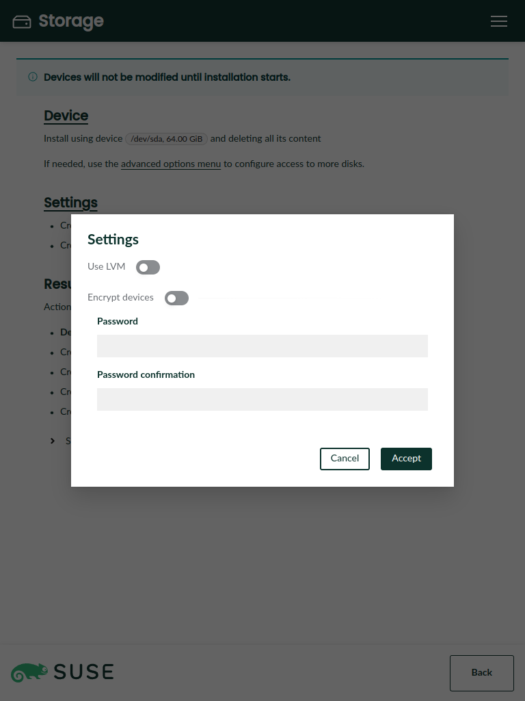

[](https://github.com/yast/agama/actions/workflows/ci.yml)
[](https://coveralls.io/github/yast/agama?branch=master)

# Agama: A Service-based Linux Installer

Agama is a new Linux installer born in the core of the YaST team. It is designed to offer re-usability, integration with third party tools and the possibility of building advanced user interfaces over it.

|||
|-|-|
|  |  |

<details>
<summary>Click to show/hide more screenshots</summary>

---


|||
|-|-|
|  |  |

|||
|-|-|
|  |  |

*Note for developers: For updating the screenshots see the
[integration test documentation](playwright/README.md#updating-the-screenshots).*

</details>

## Table of Content

* [Why a New Installer](#why-a-new-installer)
* [Architecture](#architecture)
* [How to Run](#how-to-run)
  * [Live ISO Image](#live-iso-image)
  * [Manual Configuration](#manual-configuration)
* [How to Contribute](#how-to-contribute)
* [Development Notes](#development-notes)

## Why a New Installer

This new project follows two main motivations: to overcome some of the limitations of YaST and to serve as installer for new projects like SUSE ALP (Adaptable Linux Platform).

YaST is a mature installer and control center for SUSE and openSUSE operating systems. With more than 20 years behind it, YaST is a competent and flexible installer able to cover uncountable use cases. But time goes by, and the good old YaST is starting to show its age in some aspects:

* The architecture of YaST is complex and its code-base has too much technical debt.
* Designing and building rich and modern user interfaces is a real challenge.
* Sharing logic with other tools like Salt or Ansible is very difficult.
* Some in-house solutions like libyui makes more difficult to contribute to the project.

SUSE is working on its next generation operating system called ALP (Adaptable Linux Platform). ALP is designed to be a lean core system, moving most of the software and workloads to containers and virtual machines. For some cases, for example cloud and virtual machines, ALP based systems will be deployed with auto-installable images. But still there are quite some situations in which ALP must be installed in a more traditional way. A clear example consists on installing over bare metal where some system analysis is required beforehand. Agama is also intended to cover such use cases for ALP, offering a minimal but powerful installer able to support a wide range of scenarios (e.g., RAID, encryption, LVM, network storage, etc).

## Architecture

This project is designed as a service-client system, using a dedicated D-Bus server for process
communication.


Agama consists on a set of D-Bus services and a web client (an experimental CLI is also available). The services use YaST-based libraries under the hood, reusing a lot logic already provided by YaST. Currently Agama comes with six separate services, although the list can increase in the future:

* Agama service: it is the main service which manages and controls the installation process.
* Software service: configures the product and software to install.
* Users service: manages first user creation and configuration for root.
* Language service: allows to configure the language and keyboard settings.
* Storage service: analyzes and prepares the storage devices in order to perform the installation.
* Questions service: helper service used for requesting information from clients.

Agama offers a web interface and its UI process uses the [Cockpit's infrastructure](https://cockpit-project.org/) to communicate with the D-Bus services.

## How to run

There are two ways of running this project: a) by using a Agama live ISO image or b) by cloning and configuring the project.

### Live ISO Image

The easiest way to give Agama a try is to grab a live ISO image and boot it in a virtual
machine. This is also the recommended way if you only want to play and see it in action. If you want
to have a closer look, then clone and configure the project as explained in the next section.

* [multi-product](https://build.opensuse.org/package/binaries/YaST:Head:Agama/agama-live:default/images):
  it can be used to install different products, like *openSUSE Tumbleweed*, *Leap*, *Leap Micro* or
  an experimental version of the *SUSE ALP ContainerHost OS*.
* [ALP only](https://build.opensuse.org/package/binaries/YaST:Head:Agama/agama-live:ALP/images):
  it only contains the definition for the experimental *SUSE ALP ContainerHost OS*, although
  the rest of the content is pretty much the same than the multi-product version.

### Manual Configuration

You can run Agama from its sources by cloning and configuring the project:

```console
$ git clone https://github.com/yast/agama
$ cd agama
$ ./setup.sh
```

Then point your browser to http://localhost:9090/cockpit/@localhost/agama/index.html and that's all.

The [setup.sh](./setup.sh) script installs the required dependencies
to build and run the project and it also configures the Agama services
and cockpit. It uses `sudo` to install packages and files to system locations.
The script is well commented so we refer you to it instead of repeating its
steps here.

Alternatively you can run a development server which works as a proxy for
the cockpit server. See more details [in the documentation](
web/README.md#using-a-development-server).

* Start the services:
    * beware that Agama must run as root (like YaST does) to do
      hardware probing, partition the disks, install the software and so on.
    * Note that `setup.sh` sets up D-Bus activation so starting manually is
      only needed when you prefer to see the log output upfront.

```console
$ cd service
$ sudo bundle exec bin/agama
```

* Check that Agama services are working with a tool like
[busctl](https://www.freedesktop.org/wiki/Software/dbus/) or
[D-Feet](https://wiki.gnome.org/Apps/DFeet) if you prefer a graphical one:


```console
$ busctl --address=unix:path=/run/agama/bus \
    call \
    org.opensuse.DInstaller \
   /org/opensuse/DInstaller/Manager1 \
    org.opensuse.DInstaller.Manager1 \
    CanInstall

$ busctl --address=unix:path=/run/agama/bus \
    call \
    org.opensuse.DInstaller.Language \
   /org/opensuse/DInstaller/Language1 \
    org.freedesktop.DBus.Properties \
    GetAll s org.opensuse.DInstaller.Language1
```

## How to Contribute

If you want to contribute to Agama, then please open a pull request or report an issue. You can also have a look to our [road-map](https://github.com/orgs/yast/projects/1/views/1).

## Development Notes

* [Working with the web UI](./web/README.md).
