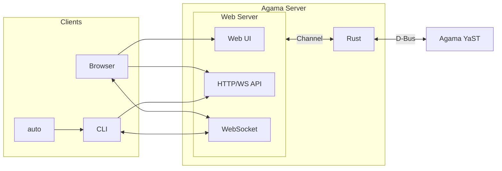

# Agama's architecture

On the surface, Agama implements a typical client-server architecture. The server offers an HTTP/
JSON API with a WebSocket to send messages to the connected clients. The web and the command-line
interfaces, part of Agama, connect to that server.

However, things are more complex, and the server comprises different pieces, as described in this
document.

## Components

On the server side, Agama is composed by:

* **Agama server**: from a user's perspective, this is the core of Agama. It is responsible for:
  * Implementing (part of) the installation logic. A good share of this logic is delegated to
    **Agama YaST**.
  * Offering an HTTP and WebSocket (HTTP/WS) interface.
  * Making the **web-based user interface** available to the browsers.

* **Agama YaST service**: it is written in Ruby and has direct access to YaST libraries.  This
  component implements complex parts, like storage and software handling. Communication with the
  Agama web server happens over D-Bus.

* **Agama D-Bus server**: implements a minimal API to allow **Agama YaST server** to talk to the web
server. It is expected to be replaced by direct communication in the future.

On the client side, these are the main components:

* **Web user interface (old `cockpit-agama`)**: Agama's graphical user interface. The **Agama web
server** makes this React application available to browsers.

* **Command Line Interface (`agama-cli`)**: it allows interaction with Agama and drives the
auto-installation process.

* **Auto-installation (`autoinstallation`)**: it is composed of a Systemd service (`agama-auto`) and
a script that relies on `agama-cli` binary.

The following diagram could be better, but it represents the main components and their interactions.

## Encryption

In the case of a remote installation, the communication between the clients and the server must be
encrypted. Connecting to port 80 (HTTP) redirects the client to port 443 (HTTPS).

About the certificate, Agama uses a self-signed certificate unless the user injects its own.

## Authentication

The HTTP interface allows authentication specifying the root password that will be checked
against PAM.

On successful authentication, the server generates a [JSON Web Token][jwt] that the client
will include in the subsequent requests. The web client stores the token in an HTTP-only
cookie[^http-only] and the CLI uses a file with restricted permissions.

[^http-only]: HTTP-only cookies cannot be accessed by client-side JavaScript.

## Skipping the authentication

When using Agama locally in the installation media, it would be unpleasant to ask for a password.
For that reason, Agama implements a mechanism to skip the authentication step. This mechanism is
documented in the [security document](./agama-security.md).

## Links

* https://bugzilla.suse.com/show_bug.cgi?id=1219688
* https://cheatsheetseries.owasp.org/cheatsheets/JSON_Web_Token_for_Java_Cheat_Sheet.html

[http-auth]: https://developer.mozilla.org/en-US/docs/Web/HTTP/Authentication
[jwt]: https://jwt.io
