# Running Agama on a z/VM machine

In order to run **Agama** on IBM Z we need to bear in mind that the live image does not contain **linuxrc**, **wicked** and the **installation-images** packages, therefore, most of the [SLE-15-SP4](https://documentation.suse.com/sles/15-SP4/html/SLES-all/cha-zseries.html) documentation is still useful and valid but the devices activation and configuration need some adaptation and so by now there is no interactive menu for configuring some parameters of the installation as that was provided by linuxrc.

The process for IPLing a z/VM installation is very similar to what is described at https://documentation.suse.com/sles/15-SP4/html/SLES-all/cha-zseries.html#sec-prep-ipling-vm but differs a little bit in the **iso** layout, in the provided **parmfile** and what is more important in the way the devices are activated and configured as well as how the installation source medium is provided, next we will describe how to do it with fetching the data from your own **FTP** server:

## Obtain the Agama live iso image

Latest **iso** images can be downloaded from:

https://download.opensuse.org/repositories/YaST:/Head:/Agama/images/iso/

```bash
wget https://download.opensuse.org/repositories/YaST:/Head:/Agama/images/iso/agama-live.s390x-ALP.iso
```

## Prepare the ISO to be served by your FTP server

Currently there is an already fixed issue in kiwi which makes the initrd root-readable only, therefore for modifying it we will extract the iso content instead of just mounting it.

```bash
# once the issue mentioned above is fixed mounting the iso should be enough
# sudo mount -t iso9660 -o loop agama-live.s390x-ALP.iso /srv/ftp

sudo mv agama-live.s390x-ALP.iso /srv/ftp/agama.iso
sudo cd /srv/ftp/
sudo isoinfo -R -X -i agama.iso
sudo chmod a+u boot s390x/initrd 
```

**Note:** Setting up an installation server (NFS or FTP) is out of the scope of this document, for further information, refer to [preparing for installation](https://documentation.suse.com/sles/15-SP4/html/SLES-all/cha-zseries.html#sec-zseries-prep) documentation.

## Example of z/VM machine installation

For connecting to the z/VM console we will use a 3270 terminal emulator provided by the x3270 package

Use the x3270 console to connect to your LPAR server

Login with your username and password

Enter the CMS (Conversational Monitoring System)
```bash
#CP IPL CMS
```

Link the TCPMAINT disk in order to have the FTP command available:

```
VMLINK TCPMAINT 592
```

Connect to the FTP server and download the needed files for IPLing the installation (in our case anonymous user is allowed):

```bash
FTP example.org (addr ipv4 
anonymous 

cd boot/s390x
locsite fix 80
ascii
get parmfile sles.parmfile.a (repl
get sles.exec sles.exec.a (repl
locsite fix 80
binary
get linux sles.linux.a (repl 
get initrd sles.initrd.a (repl 
quit
```

**Note:** the command `locsite fix 80`, which sets the VM file format to fixed length 80, the file format necessary for punching the binary files to the virtual machine reader.

You can use the FILELIST command to list the files and edit the **parmfile** if needed with XEDIT.

For our machine the parmfile is:

```txt
cio_ignore=all,!condev
rd.cio_accept=0.0.0160
rd.zdev=qeth,0.0.0800:0.0.0801:0.0.0802,layer2=1,portno=0
ip=192.168.0.111::192.168.0.1:24:zvmtest.example.org:enc800:none
nameserver=192.168.0.1
root=live:http://example.org/agama.iso
```

Although **cio_ignore** parameter is optional we used it in order to list only the relevant installation devices accepting the ones which we will use for the installation. 

As we do not have an interactive dialog for enabling and configuring our network device we need to provide the settings through the kernel command line, in this case we will use rd.zdev option for activating our qeth device and the ip option for configuring network settings the enc800 linux network interface.

Finally we will boot from a live image retrieved from an url using the **root=live:<url>** parameter.
  
The content of the sles.exec file is:

```txt
/* REXX LOAD EXEC FOR SUSE LINUX S/390 VM GUESTS       */
/* LOADS SUSE LINUX S/390 FILES INTO READER            */
SAY ''                                                   
SAY 'LOADING SLES FILES INTO READER...'                  
'CP CLOSE RDR'                                           
'PURGE RDR ALL'                                          
'SPOOL PUNCH * RDR'                                      
'PUNCH SLES LINUX A (NOH'                                
'PUNCH SLES PARMFILE A (NOH'                             
'PUNCH SLES INITRD A (NOH'                               
'IPL 00C'                                                
```

Once ready boot the installation running the **sles.exec** REXX file

```bash
sles
```

Once the installation system finish the booting process just connect to the machine with the web browser (e.g. https://s390vsl111.suse.de) or by SSH with (root / linux) user.

## Screenshots of the complete installation Z/VM installation workflow

For taking the screenshots we have omitted the cio_ignore parameter from the parmfile and as dhcp config is supported the config is quite simple as we can see below:
```txt
rd.zdev=qeth,0.0.0800:0.0.0801:0.0.0802,layer2=1,portno=0
root=live:http://example.org/agama.iso
```

Below you will find the screenshots of an z/VM installation selecting the ALP Micro product and doing the activation and format of the DASD device with Agama:

|||
|-|-|
| 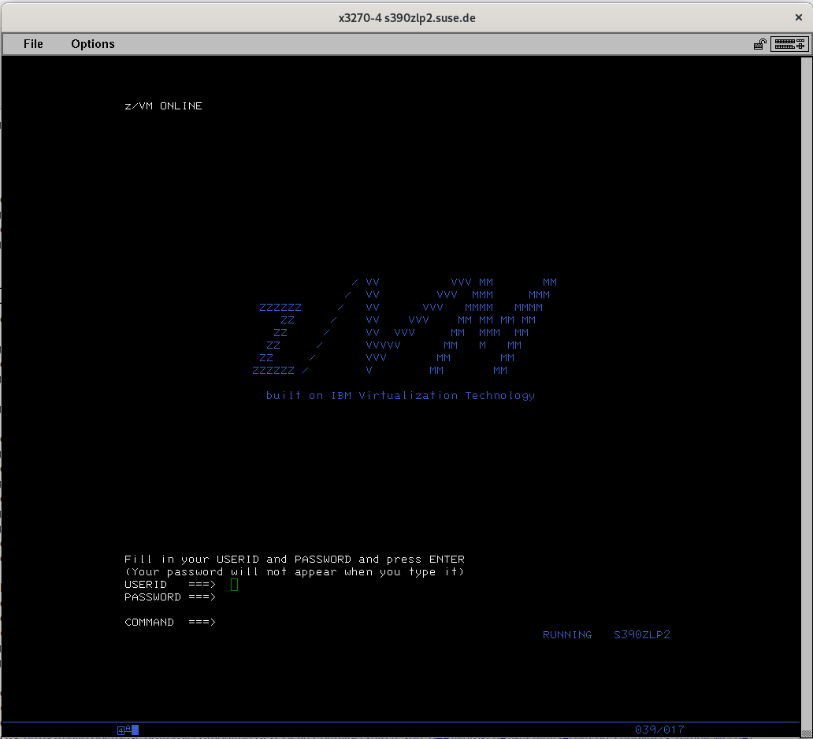 | 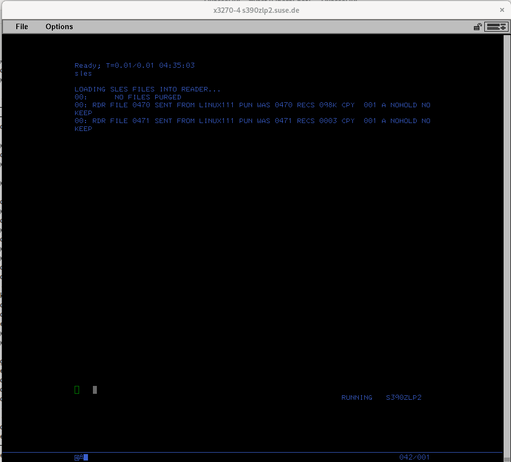 |
| 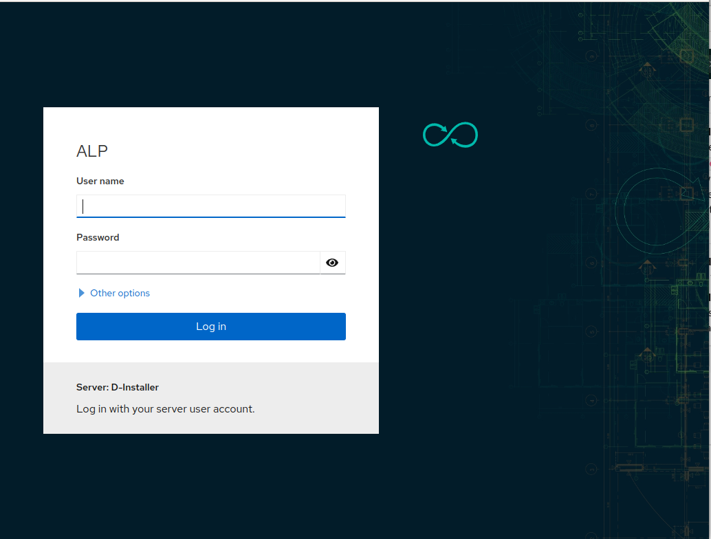 | 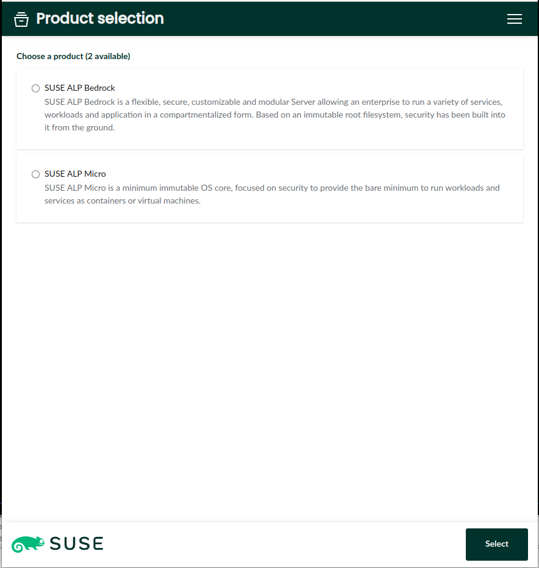 | 
| 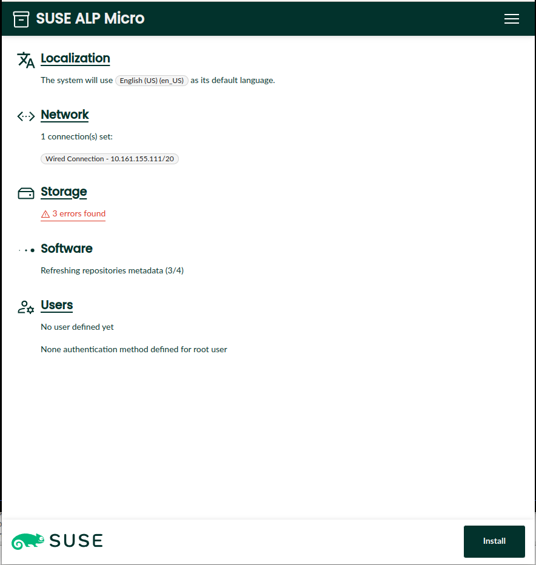 | 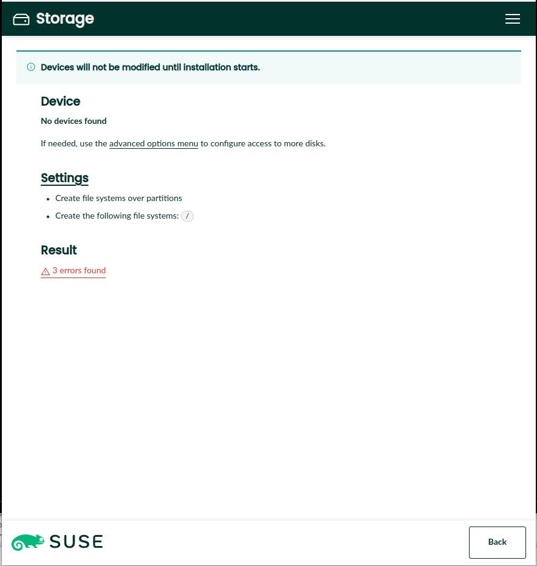 |
| 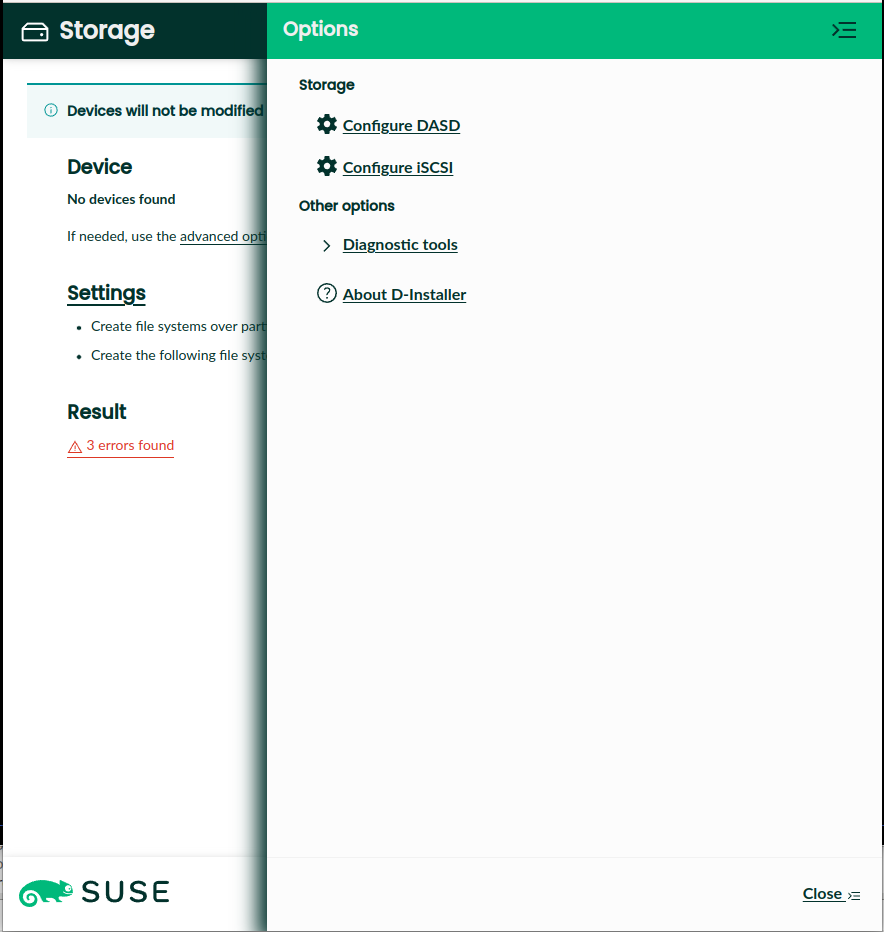 | 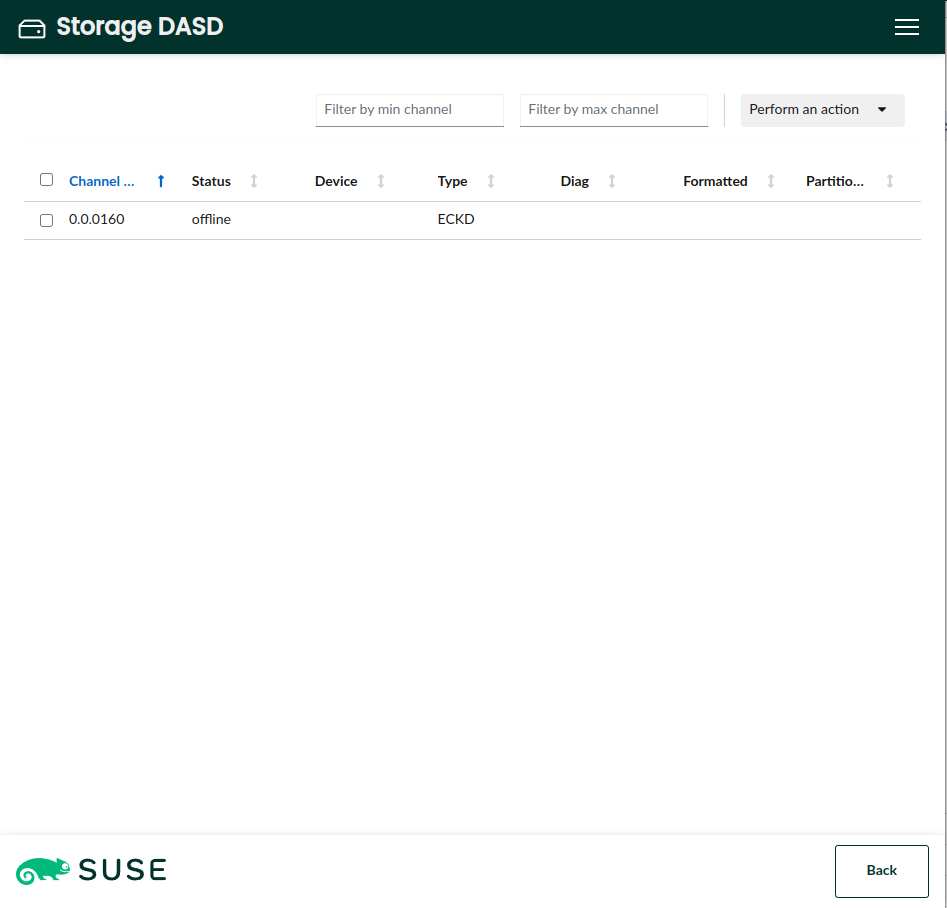 |
| 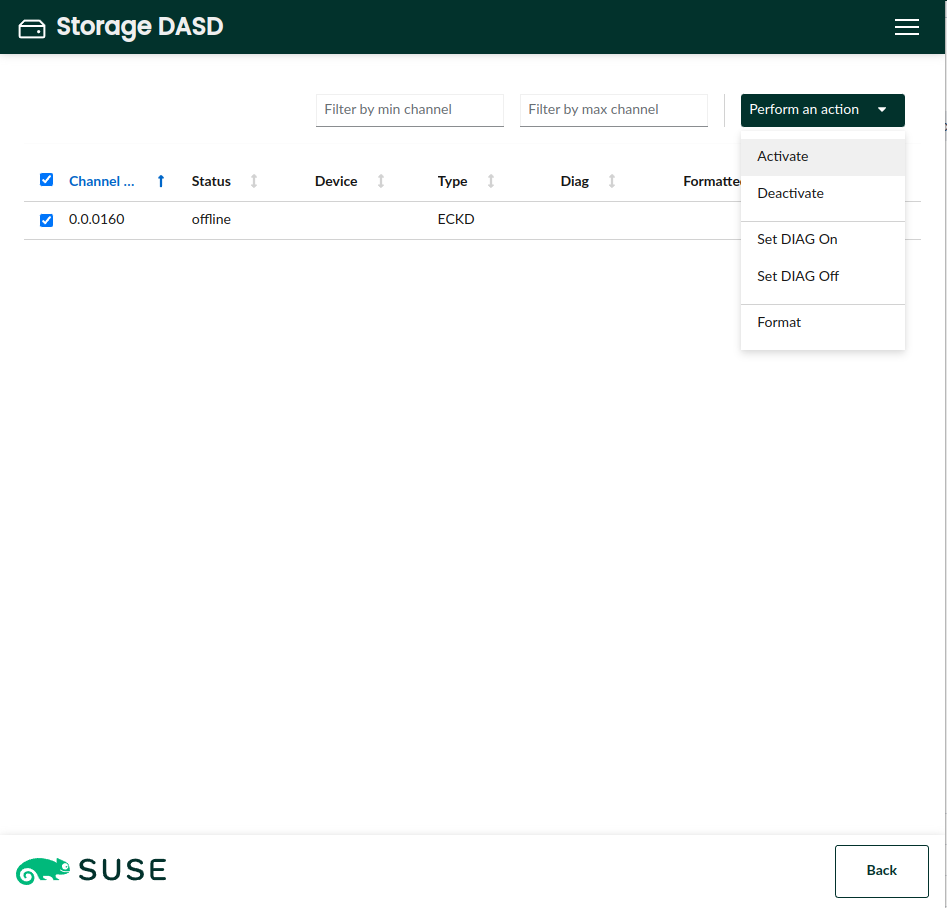 | 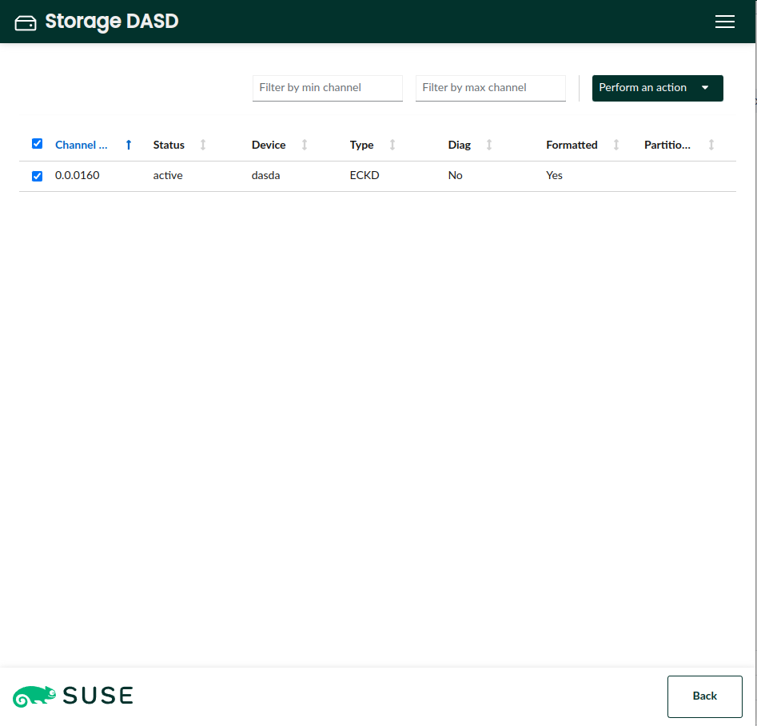 | 
| 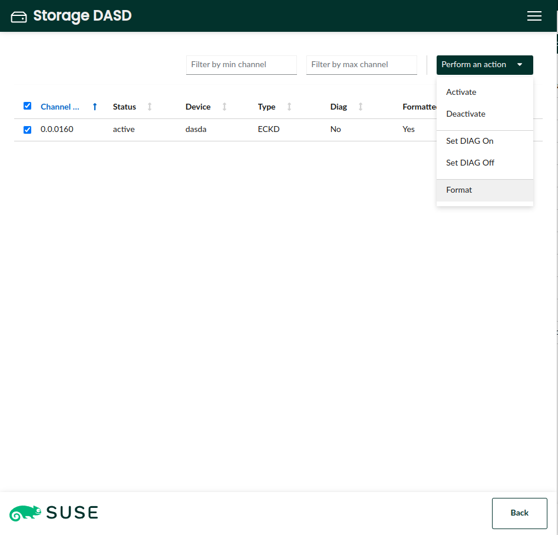 | 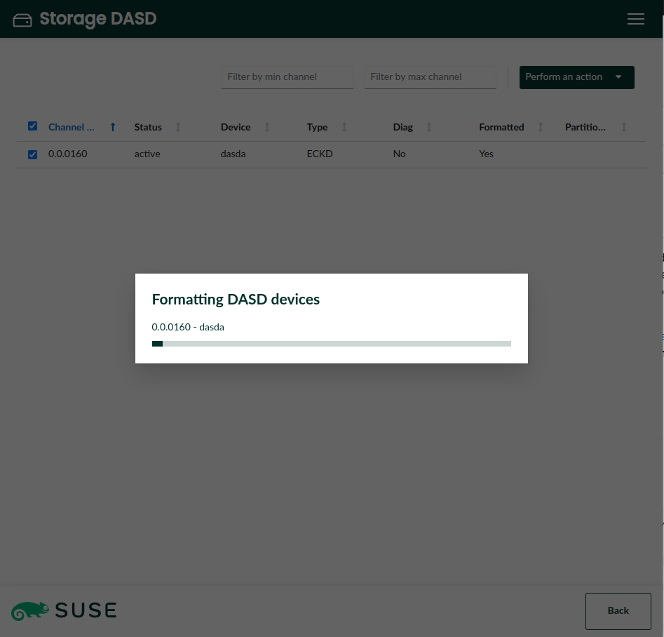 |
