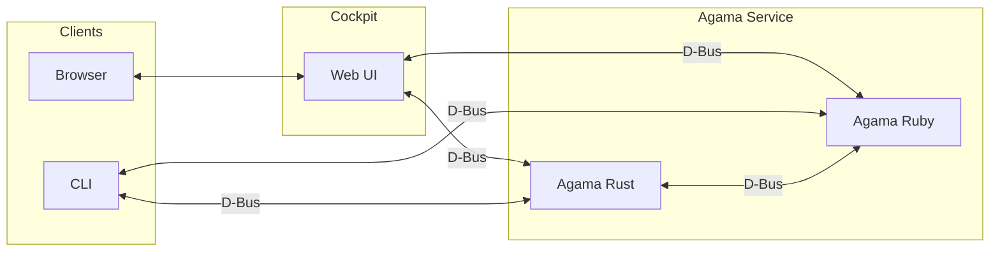
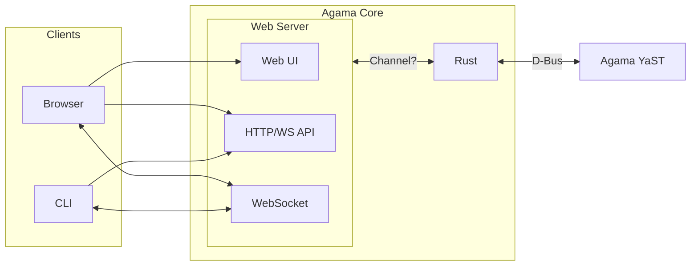

# Agama's 2024 architecture

This document describes the proposal for the new Agama architecture. The reasons for introducing
these changes are recorded in [a discussion in Agama's repository][drop-cockpit].

[drop-cockpit]: https://github.com/openSUSE/agama/discussions/1000

But before describing how the architecture should look, let's quickly look at the current status.

## The current architecture

At this point, Agama is composed of four high-level components:

* **Agama service**: implements the logic to perform the installation. It is the core component of
Agama and it offers a D-Bus interface. Actually, it is composed of two services: `rubygem-agama` and
`agama-dbus-server`.

* **Web user interface (`cockpit-agama`)**: a web-based interface that plays the role of a GUI when
using Agama live.

* **Command Line Interface (`agama-cli`)**: it allows to interact with Agama core and drives the
auto-installation process.

* **Auto-installation (`autoinstallation`)**: it is composed by a Systemd service (`agama-auto`) and
an script that relies in `agama-cli`.

In addition to those components, we need to consider Cockpit, which plays a vital role:

* It makes communication between the web UI and the D-Bus services possible.
* It makes the web UI code available to the browser.
* It takes care of authenticating the user when connecting remotely. Again, it is only relative to
the web UI.

## The new architecture

The proposed architecture is not that different from the current one, but it tries to meet these
goals:

* Drop our dependency on Cockpit.
* Implement a higher-level API to be consumed by the clients, replacing D-Bus for client-server
communication. Agama will still use D-Bus for IPC between the Rust and Ruby components.

### Components

With those goals in mind, we are considering the following components:

* **Agama core (old `agama-dbus-server`)**: implements the installation logic. It relies heavily on
the Agama YaST service.

* **Agama YaST service (old `rubygem-agama`)**: it is written in Ruby and has direct access to YaST
libraries. Complex parts, like storage and software handling, are implemented in this component.

* **HTTP and WebSocket API**: implements the API the clients should use to communicate with Agama.
Under the hood, it still uses D-Bus for communication between Agama core and Agama YaST.

* **Web user interface (old `cockpit-agama`)**: Agama's graphical user interface. The web server
makes this React application available to the browsers.

* **Command Line Interface (`agama-cli`)**: it allows interaction with Agama and drives the
auto-installation process. With the new architecture, connecting through the network might be
possible without SSH.

The following diagram could be better, but it represents the main components and their interactions.

### The web-based API

The new web-based API is divided into two different parts:

* **HTTP/JSON API**: allows clients to execute actions or query Agama. For instance, it could get
the list of available products, request a new storage proposal or start the installation. About the
approach, something REST-like is the most suitable. Switching to GraphQL or gRPC do not seem to be
needed in our case (todo: write why).

* **WebSocket**: Agama will use WebSockets to notify clients about any relevant event: progress,
configuration changes, etc. The event's format is not defined yet, but a JSON event containing the
`type` and the `payload/details` should be enough[^topics].

[^topics]: Ideally, the clients should be able to subscribe to the topics they are interested in.
    But that feature can wait.

### Encryption

In the case of a remote installation, the communication between the clients and the server must be
encrypted. Connecting to port 80 (HTTP) should redirect the client to port 443 (HTTPS).

About the certificate, Agama will use a self-signed certificate unless the user injects its own
certificate (through a kernel command line option).

NOTE: under discussion.

### Authentication

The HTTP interface should allow authentication specifying a user and password that will be checked
against PAM. It is not clear yet, but we might need to check whether the logged user has permissions
(most probably through Polkit).

On successful authentication, the server generates a [JSON Web Token][jwt] that the client will
include in the subsequent requests. The web client stores the token in an HTTP-only
cookie[^http-only] and the CLI uses a file with restricted permissions.

[^http-only] HTTP-only cookies cannot be accessed byt client-side JavaScript.

#### Skipping the authentication

When using Agama locally in the installation media, it would be unpleasant to ask for a
user/password. For that reason, there must be a mechanism to skip the authentication step. Agama
Live could run a special service that generates a valid token and injects such a token into the
server, the CLI and the web browser.

## Links

* https://bugzilla.suse.com/show_bug.cgi?id=1219688
* https://cheatsheetseries.owasp.org/cheatsheets/JSON_Web_Token_for_Java_Cheat_Sheet.html

[http-auth]: https://developer.mozilla.org/en-US/docs/Web/HTTP/Authentication
[jwt]: https://jwt.io
