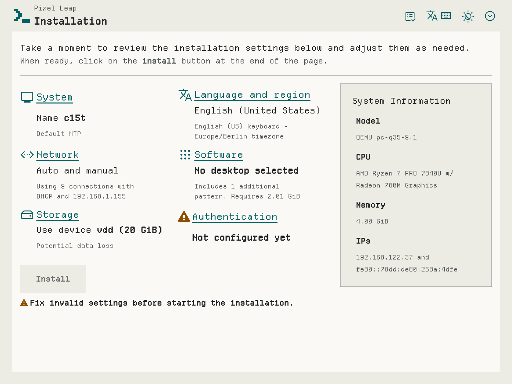
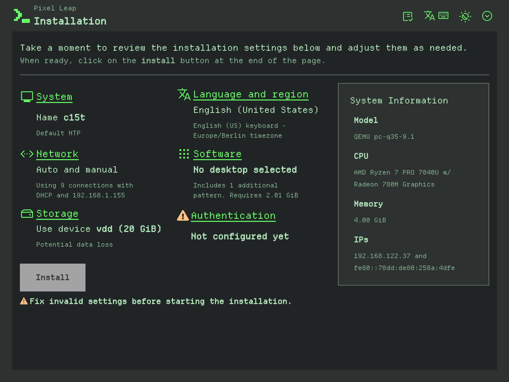

# Creating a product appearance

The Agama web UI can be restyled for a product without touching application
code: colors, logo, and a handful of other roles are set in a single per-product
file, loaded at runtime after Agama's own styles.

Two things meet in that file, and this document keeps them apart. The **product
appearance** is what a product writes: the palette, the logo and a few related
roles that make the installer read as that product. The **color scheme** is
light or dark, and it belongs to whoever is installing, who picks it in the
appearance menu or inherits it from their system, alongside a separate contrast
setting. A product writes the stylesheet and never picks the scheme, so that
stylesheet has to say how its colors behave in both.

This document is about designing and writing that file.
[product_theming_packaging.md](product_theming_packaging.md) covers getting it
onto a medium, which a product ships from its own package: no change to Agama's
source or style files is involved.

**The short version.** Copy `example.css`, set only the roles the brand needs,
add a light and a dark logo. Measure every contrast pair the checklist lists, in
both color schemes, with the script rather than the eye. Then look at the result
in a running installer, because half of what goes wrong has no number attached.
If the brand needs something no role covers, propose the role instead of
reaching past it: that contract is the whole reason a product stylesheet
survives an Agama upgrade.

- [What a product can change](#what-a-product-can-change) and [what it
  cannot](#what-a-product-cannot-change)
- [The roles](#the-roles), and [the steps](#steps) in order
- [Contrast checklist](#contrast-checklist), plus [brand colors that cannot be a
  fill](#when-the-brand-color-cannot-be-a-fill) and [elevation in dark
  mode](#elevation-in-dark-mode-and-why-tooltips-differ)
- [Accessibility](#accessibility), where a palette does the most damage
- [Using a font of your own](#using-a-font-of-your-own)
- [Manual checks](#manual-checks), the half that no number reports
- [Extending the role API](#extending-the-role-api), when the roles fall short
- [Optional: starting from an AI draft](#optional-starting-from-an-ai-draft),
  and why [the second round is the real
  one](#the-second-round-is-the-real-one)

## What a product can change

- **Colors and roles**: a curated set of `--agm-t--*` CSS custom properties, see
  "The roles" below.
- **Logo**: a light and a dark SVG with a transparent background, named after
  the product's `icon:` field with `-dark` before the extension on the dark one
  (`MyProduct.svg` and `MyProduct-dark.svg`). A roughly
  square aspect ratio travels best, since each usage context (masthead, next to
  the product name, ...) renders the logo at a small fixed width: a very wide
  drawing shrinks to stay inside it, and a very tall one takes over the row it
  sits in. Center the drawing within the viewBox too, offsetting the viewBox
  when it helps, because the UI aligns the image box and not the ink: artwork
  sitting low in an otherwise square box hangs below the product name beside it.

How far that goes is easier to see than to describe. The two products below do
not exist and ship with nothing. They mark the two ends of the range: one sets
the least a product can, the other everything the role set allows. Each is the
same installer screen.

> [!NOTE]
> The screenshots were taken in August 2026. What each product does to the
> interface is the point; the interface around it might have moved on since.

**Colors and a logo, nothing else.** A published brand used as published: its
blue on white in light, the same hue taken down to page darkness in dark. Every
other role stays at Agama's value, typography included, so the text keeps the
[SUSE typeface](https://brand.suse.com/typography) Agama bundles. This is what
most products need, and it is the whole of the file behind it: the same roles
[`example.css`](../web/src/assets/products/example.css) sets, and no more. The
brand is the [Fedora Project's](https://docs.fedoraproject.org/en-US/project/brand/),
borrowed as a friendly nod to a neighbour: Agama's interface is built on
PatternFly, the open source design system Red Hat publishes, and Red Hat
sponsors Fedora. No Fedora logo, artwork or name appears in the result, and
Fedora is a trademark of Red Hat, Inc.

| Light | Dark |
| --- | --- |
|  |  |

**Every role there is.** The other end of the range: an 80s terminal, phosphor
green on charcoal, with a pixel drawing for a logo. It sets colors, its own
typeface ([Departure Mono](https://departuremono.com/), see
[Using a font of your own](#using-a-font-of-your-own)), the font and icon size
scales, square corners and the logo sizes: every role
[`example-advanced.css`](../web/src/assets/products/example-advanced.css)
documents, given a value by a brand. Its light scheme is a different design, ink
on paper, since phosphor green only works on a dark page.

| Light | Dark |
| --- | --- |
|  |  |

Everything between the two is fair game, and that is where most products land:
colors and a logo, plus the one or two roles the brand actually turns on, say
square corners or a typeface. Nothing has to be set as a group, and every role
left alone keeps Agama's value.

> [!TIP]
> However far you go, contrast is the part worth getting right. A palette that
> looks fine on the screen you designed it on can be unreadable on a dim laptop
> panel, in a sunlit room, or to someone with low vision, and an installer is a
> bad place to lose a warning or a button label. It is measurable, so measure it:
> the [contrast checklist](#contrast-checklist) says which pairs matter, and
> `web/scripts/check-contrast.js <foreground> <background>` gives you the number
> for one in a second, plus a shade of the same hue when it falls short.

## What a product cannot change

Naming these upfront saves an afternoon of trying:

- **High contrast.** It is an accessibility mode, fully governed by PatternFly.
  A product may brand the accent there and nothing else.
- **The font family in some locales.** Cyrillic, Georgian, Chinese, Japanese and
  Korean get their family assigned per language for script coverage, and that
  takes precedence over the product roles. A product's typeface does not apply
  to those languages.
- **Line height.** No role exposes it, deliberately: it resolves from a single
  value used everywhere, so a product that sets it badly costs every screen at
  once. A large jump in the font size scale tightens the text block with nothing
  to compensate with, so keep the jump modest, or make the case for a role.
- **The JSON config editor.** It follows the light/dark scheme only, so it keeps
  its own colors next to a branded UI. Expected, not a bug to work around.

## The roles

Three files in the Agama sources carry the role set:

- [`_semantic.scss`](../web/src/assets/styles/tokens/_semantic.scss) defines
  every `--agm-t--*` role and maps it onto the PatternFly tokens it drives. The
  index comment at the top names each role and says what it paints: that is the
  list to read.
- [`example.css`](../web/src/assets/products/example.css) is the colors-only
  starting point, and covers most products.
- [`example-advanced.css`](../web/src/assets/products/example-advanced.css) sets
  every role, each with a comment explaining it.

Read one of the examples before writing your own.

**A product stylesheet sets these roles and nothing else.** Raw PatternFly
tokens, component-level variables and selectors of your own are out of bounds:
unsupported, and at risk of breaking silently the next time the mapping
underneath them moves. The roles exist so that a product never has to know how
many PatternFly tokens one decision touches, and that only holds while the file
stays inside them. Where the brand needs something no role covers, propose it
and let it be weighed: one product's requirement is a case to consider, not by
itself a reason to widen a surface every product depends on. See [Extending the
role API](#extending-the-role-api).

Between them the roles cover the brand and link colors, the three surfaces and
the hover background, text and icon colors, borders and the focus ring, the
disabled and tooltip pairs, the five status colors, and then typography, font
and icon sizes, corner radius, and the logo's size and alignment.

Color roles are scoped per color scheme, so each goes inside the matching block,
while everything else goes in a plain `:root`.

An unset role keeps Agama's own value, so a stylesheet is only as long as the
brand requires. This one is complete, and enough for many products:

```css
/* Light scheme. */
:root:where(:not(.pf-v6-theme-dark)) {
  --agm-t--brand--color: #3c6eb4;
  --agm-t--brand--text--color: #fff;
  --agm-t--link--color: #294172;
  --agm-t--surface--color--raised: #e8eff8;
  --agm-t--status--danger--color: #c42366;
}

/* Dark scheme. */
:root:where(.pf-v6-theme-dark) {
  --agm-t--brand--color: #51a2da;
  --agm-t--brand--text--color: #0b1521;
  --agm-t--link--color: #aad0ee;
  --agm-t--surface--color--raised: #16273d;
  --agm-t--status--danger--color: #f0819f;
}
```

The `:where()` selectors are what scopes a color to one scheme; they carry no
specificity of their own, so a product keeps the same weight as Agama's own
styles instead of starting an arms race with them.

## Steps

1. **Find the product id.** It is the `id:` field of the product's file in
   `products.d/`, and it is what the stylesheet has to be named after
   (`<id>.css`). A name that does not match loads nothing, and says nothing
   about why. The logo files take the `icon:` field instead; the two often
   differ.
2. **Start from an example.** Copy `example.css` or `example-advanced.css`,
   linked under [The roles](#the-roles) above.
3. **Set only the roles the brand needs**, colors inside the scheme block that
   matches, everything else in a plain `:root`.
4. **Give each scheme its own premise.** A dark scheme is not a light one with
   the lights turned off: the same color that reads calm on white glares on
   charcoal, and a brand color that carries a white label may be unreadable
   there. So a brand that is natively dark still needs a light scheme designed
   for paper, and the other way round.
5. **Draw the two logos**, light and dark, as described above.
6. **Measure the checklist below**, in both schemes separately, since a value
   that passes in one can fail in the other. Work through the rows rather than
   the pairs that come to mind.
7. **Look at it in a running installer**, following the manual checks. The
   quickest loop copies the file straight into the served directory of a
   running installer, no rebuild in between; see
   [product_theming_packaging.md](product_theming_packaging.md).

None of this needs a build of Agama, or a change to it. If you would rather
start from a draft than from a blank file, there is a prompt for an AI at the
end of this document, but everything above is written to be followed by hand.

## Contrast checklist

The Agama sources ship a helper for this, `web/scripts/check-contrast.js
<foreground> <background> [--target=4.5]` (run from the repo root). It reports
the ratio against the 3:1, 4.5:1 and 7:1 thresholds and, when a pair fails,
suggests a same-hue, same-saturation shade that passes, which keeps a brand
color recognizable instead of drifting to an unrelated one.

The table below is a strong recommendation rather than a gate: nothing checks an
appearance at build time, and a product ships what it decides to ship. The bar
it aims at is WCAG AA, in both schemes, and what a shortfall costs is paid by
whoever cannot read the screen.

Checking it by hand is one invocation per pair, so start where products actually
fail: borders against all three surfaces, statuses against raised and floating,
the brand text color on its fill, and the focus ring with its separator.

| Foreground             | Background                                                                                                                                                                    | Target |
| ---------------------- | ----------------------------------------------------------------------------------------------------------------------------------------------------------------------------- | ------ |
| body text, subtle text | page, raised, floating, hover backgrounds                                                                                                                                     | 4.5    |
| disabled text          | page and the disabled background                                                                                                                                              | 4.5    |
| link color             | page, raised, hover background                                                                                                                                                | 4.5    |
| each status color      | page, raised **and** floating surfaces (inline alerts take the page background, toast alerts the floating one, and status text also lands on cards and other raised surfaces) | 4.5    |
| brand text color       | the brand fill **and** its hover shade                                                                                                                                        | 4.5    |
| tooltip text           | tooltip background                                                                                                                                                            | 4.5    |
| border color           | page, raised, floating                                                                                                                                                        | 3      |
| focus ring             | the surface outside the control; **and** the separator against both the ring and the fill                                                                                     | 3      |
| icon color             | every surface the icons appear on                                                                                                                                             | 3      |

The focus ring row needs a picture to make sense. A focused control draws its
ring just inside its own edge, and a hairline of
`--agm-t--focus--separator--color` sits between that ring and the fill behind
it.

The hairline is there because a ring on its own is not always visible: a
brand-colored ring on a brand-colored button has nothing to separate it from the
fill, and a pale ring has nothing to separate it from a pale one. So the ring
has to clear the surface outside the control, and the hairline has to clear what
sits on either side of it, which is the ring and the fill.

### When the brand color cannot be a fill

When a published brand color turns out too light to carry a white label, try a
dark label before inventing a darker brand nobody would recognize, and let the
checklist say which of the two passes. If neither does, take the tool's same-hue
shade for the fill and keep the published color where 3:1 is the bar, such as
the focus ring and the icons, so the brand still appears somewhere verbatim.

### Elevation in dark mode, and why tooltips differ

Containers above the page (cards, menus, popovers, modal dialogs) read _lighter_
than the page in dark mode: raising a surface adds light. PatternFly's own dark
palette does it, as do Material and Apple's Dark Mode, so raised or floating
going darker reads as a mistake.

Tooltips are the exception. Transient and small, they want maximum separation
from what they cover, so PatternFly and Material both treat them as an
_inverted_ surface rather than an elevated one: near-white with dark text in
dark mode. Light, dark and inverted are all defensible here. What decides it is
the tooltip's own text contrast, in the checklist, plus whether it separates
from what is behind it: on a very dark page, a darker tooltip leaves the shadow
and the arrow carrying the whole edge. That can be deliberate, so look at it on
a busy screen. No WCAG criterion covers surface-to-surface separation, which is
why this is a design call rather than a number.

**Judge separation on absolute luminance, not on a ratio.** The same ratio means
far less separation near black than near white. One product separated its light
surfaces by 0.113 and 0.078 of relative luminance and its dark ones by 0.006 and
0.010, at comparable ratios: the dark scheme cleared "lighter than the page" and
still read as a single flat field, leaving borders and shadows to carry every
edge. If dark looks flat next to light, the fix is more light, not a better
ratio.

## Accessibility

These are where a palette does the most damage. They stand as the checklist
does: nothing enforces them, and each is the product's call. Two are also WCAG
AA criteria rather than house style, contrast and resizing, and those are the
ones a user is most likely to notice.

- **Color is never the only channel.** The five status roles have to stay
  distinguishable from each other, not just from their background. Check the
  red/green pairs (danger against success, caution against danger) as they would
  read with a color vision deficiency, and resist collapsing several statuses
  into the brand color.
- **And distinguishable from the brand, link and focus colors.** A status color
  that matches the link color disappears the moment the two meet: an icon
  signalling an issue next to a heading that is also a link reads as decoration.
  Where they collide, move the brand side rather than the status, since the
  status meaning is conventional and the brand is not.
- **Text has to survive resizing.** Keep the size roles in relative units and
  check the UI at 200% zoom. Also check 1024x768: some install screens run at
  that size, and Agama deliberately gives them the wide layout.
- **A font family has to cover the translated UI.** A face that stops at Latin
  makes a translated screen switch faces mid-sentence, and a single-weight face
  leaves headings and emphasis with nothing to render with. Check a verbose
  locale (German, Russian) too: long strings plus a wide face is where text
  starts to truncate.
- **Disabled has to look disabled and stay readable.** Both at once, which is
  why the disabled pair is in the checklist.
- **Do not fight the operating system.** Forced-colors mode is not a place to
  reassert a palette, any more than high contrast is.

## Using a font of your own

A product can bring its own typeface: its stylesheet may carry its own
`@font-face` declaration, so this needs no change in Agama.

```css
@font-face {
  font-family: "My Product Mono";
  font-weight: 100 900; /* claim only what the file provides: claiming more gets
                           bold synthesized or ignored */
  font-style: normal;
  src: url("./fonts/MyProductMono.woff2") format("woff2");
}

:root {
  --agm-t--font--family--mono: "My Product Mono", "SUSE Mono", monospace;
}
```

Two faces at the same nominal size rarely look the same size: a pixel display
face fills most of its em, a typewriter face has a small x-height. When the
mismatch is the face rather than the scale, `size-adjust` is the lever, since it
corrects the face alone:

```css
@font-face {
  font-family: "My Display Face";
  src: url("./fonts/MyDisplayFace.woff2") format("woff2");
  size-adjust: 90%; /* its capitals fill 0.875em, a text face's fill 0.66em */
}
```

Set it from the ratio of cap heights, then look at it. Advance width scales
along with it, so a body face 25% larger needs 25% more width and the summary
columns run out first; a display face is bounded by the longest heading, which
shows up in the breadcrumb trail.

The size roles stay available for a brand that genuinely wants larger or smaller
text than Agama's. Choose between the two deliberately: the scale moves every
text in the UI, so reaching for it to rescue a single font also makes everything
else hard to compare with any other.

Always leave fallbacks after the new family, so a font that fails to load
degrades to a bundled one rather than to the browser default. Agama bundles the
[SUSE typeface](https://brand.suse.com/typography) it uses by default ("SUSE
Text", "SUSE Display" and "SUSE Mono"), plus "Roboto Mono" and the Noto Sans
families. A family installed on the machine running the browser also works while
designing, but the official ISO ships only the curated set Agama's own defaults
need, so a typeface of your own has to travel with the product.

Where the font file itself lives, its license, and its size are packaging
concerns: see [product_theming_packaging.md](product_theming_packaging.md).

## Manual checks

Clearing the contrast checklist is worth the effort, and it still leaves half
the job: the work is only done once a person has actually seen it running, in
light, dark and high contrast. Drive the real installer rather than a single
static page.

Where the roles actually surface:

- product selection page and masthead (logo sizes and alignment),
- a form with an invalid field (danger color, focus ring, disabled controls),
- a long storage table (text size, truncation, borders),
- a modal dialog, a menu, a popover, a tooltip (floating surfaces),
- toast and inline alerts, all five statuses,
- a progress screen (accent on large surfaces),
- an empty state and a breadcrumb (subtle text),
- the skip link, by pressing Tab on a freshly loaded page: it takes the brand
  fill and its text color, and it is the first thing a keyboard user meets.

The quickest way to iterate is to write the file straight into the served
directory of a running installer, described in
[product_theming_packaging.md](product_theming_packaging.md): the reload picks
it up, with no rebuild in between.

## Extending the role API

Every role is documented and resolved in one place:
`web/src/assets/styles/tokens/_semantic.scss` maps each `--agm-t--*` role onto
the PatternFly tokens it affects, with the current Agama value as the fallback
default.

Adding a role that's genuinely missing:

1. Add the role to `_semantic.scss`'s role-index comment and resolve it at its
   real consumption point (a PF global token in `_semantic.scss`, or a
   component-level override in `_patternfly-overrides.scss`), with the current
   Agama value as the fallback so leaving it unset changes nothing.
2. Document it with a worked example in `example-advanced.css`.
3. Before assuming one token covers a whole category (e.g. "corner radius"),
   check whether PatternFly actually splits that concern into several
   independent tiers under the hood; grep the component CSS for the relevant
   property and trace each occurrence back to its root token.

This one does go through Agama: it changes the shared layer that every product
depends on.

## Optional: starting from an AI draft

Everything above is written to be followed by hand, and a stylesheet written
that way is the reference case, not the exception. This section is for speeding
up the blank-file stage with whichever assistant you already use.

Treat what comes back as a starting point rather than a result. It can read the
role set, compute contrast and produce a plausible file; it cannot look at the
installer, which is where the other half of the work is. The prompt therefore
names the files to read, the script to run and where the result goes, and opens
by making sure those exist. Fill in the placeholders and paste:

> Work inside a checkout of the Agama sources. If you are not in one, clone
> https://github.com/agama-project/agama and work there: the files named below
> are how you find the current role set, and answering from memory instead
> produces a stylesheet that looks plausible and sets roles that do not exist.
>
> Create a product stylesheet for `<PRODUCT_ID>` using this brand: `<paste
colors, and/or a link to the brand's site or guidelines>`. Take the id from
> the `id:` field of the matching file in `products.d/`, not from a logo file
> name: the two often differ. The file is `<id>.css`, and a name that does not
> match loads nothing and says nothing about why.
>
> First read `web/src/assets/products/example.css`, `example-advanced.css`, and
> the role-index comment at the top of
> `web/src/assets/styles/tokens/_semantic.scss`, so you know the current
> `--agm-t--*` role set rather than assuming it. A product file only ever sets
> these roles; never a raw PatternFly or component-level variable directly.
>
> Set only the roles the brand actually needs. Every role left unset keeps
> Agama's own value, so a file that sets colors, a logo and a font family is
> finished. Reach for the size, radius and spacing roles only where the brand
> genuinely differs, and say why when you do.
>
> Some things a product cannot control, so do not spend effort there: the high
> contrast mode belongs to PatternFly and a product may brand its accent and
> nothing else, line height has no role, and Cyrillic, Georgian, Chinese,
> Japanese and Korean get their family assigned per language, so a product's
> typeface does not reach them.
>
> Every pair you set has to clear WCAG AA: 4.5:1 for text against the background
> it sits on, 3:1 for borders, icons, focus indicators and anything else that is
> not text. That is the bar whether or not you can open the files named here.
>
> Read `doc/product_theming.md` for which pairs to check, and compute each one
> explicitly with `web/scripts/check-contrast.js <foreground> <background>
[--target=4.5]` (run from the repo root; `--target=3` for the non-text ones),
> in both light and dark separately, rather than eyeballing. Measure every row
> of the checklist, especially the ones easy to skip: statuses against the
> raised and the floating surface as well as the page, borders against all
> three, and the focus ring against the surface around it, with
> `--agm-t--focus--separator--color` carrying the contrast against the fill
> rather than the ring itself. Where a brand color fails, use the tool's
> suggested same-hue/saturation shade rather than an unrelated substitute.
> Raised and floating surfaces read lighter than the page in dark mode, not
> darker; the tooltip roles are a separate call, see the elevation notes in the
> document. Report the numbers you measured as a table.
>
> Keep the five status colors distinguishable from each other, not only from
> their background, and do not collapse them into the brand color: they carry
> meaning that color alone must not be responsible for. Simulate protanopia and
> deuteranopia over the five and report the closest pair. Also check them
> against the brand, link and focus colors: a status that matches the link color
> disappears where the two meet, such as an issue icon beside a heading that is
> a link. Where they collide, move the brand side, not the status.
>
> For surfaces, report the absolute relative luminance of page, raised and
> floating, not only their ratios: near black the same ratio means far less
> separation than near white, so a dark scheme can clear "lighter than the page"
> and still read as one flat field. Compare the separation you get in dark
> against the one you get in light, and say whether elevation or the border is
> carrying the edges.
>
> If the brand is natively a dark look, design the light scheme as its own thing
> rather than inverting the dark palette, and say what premise you gave each
> one.
>
> If you touch the typography roles: keep them in relative units, check the
> result at 200% zoom and at 1024x768, and make sure the family covers the
> languages the UI is translated into (a Latin-only face switches faces
> mid-sentence). Name a family only when it is reachable (bundled by Agama,
> installed on the system running the browser, or shipped with the product),
> always with fallbacks after it, and never add font files to Agama itself as
> part of a product.
>
> Do not raise the size scale to compensate for a font that looks small or
> large. Use `size-adjust` on its `@font-face`, computed from the ratio of cap
> heights against a normal text face, and report both the cap heights and the
> advance widths you measured. Advance width is the constraint that bites: a
> body face scaled up widens every line by the same factor, so check the longest
> sentence in the UI and the narrowest column before settling on a value. A
> single-weight face means synthesized bold; say so rather than discovering it
> later.
>
> An icon is not automatically the color of the text it labels. If you change
> the icon color role, check it against both headings and status icons.
>
> For the logo: a light and a dark SVG with a transparent background, named
> after the product's `icon:` field rather than its id, the dark one with
> `-dark` before the extension. Read `ProductLogo` and its callers first to find
> the actual rendered size each usage needs, keep the aspect ratio roughly
> square so the logo survives all of them, and center the drawing inside the
> viewBox, since the UI aligns the image box and not the ink. Validate any
> hand-edited SVG with `xmllint --noout` and a rendered preview at the real
> consuming size, in both color schemes, before calling it done.
>
> **If something can't be done with the current `--agm-t--*` role set, don't get
> creative.** Do not set a raw PatternFly token or component-variable override
> from the product CSS file, and do not work around the "products only set
> `--agm-t--*` roles" contract. Stop and present a plan for extending the shared
> token API instead: the new role's name, where it gets documented (a role-index
> comment in `_semantic.scss`) and resolved (a PF global token in
> `_semantic.scss`, or a component-level override in
> `_patternfly-overrides.scss`, with the current Agama value as the fallback
> default so leaving it unset changes nothing), a worked example added to
> `example-advanced.css`, and whether PatternFly actually splits the underlying
> concern into several independent tokens under the hood (check before assuming
> one override reaches everywhere it should). Get that plan approved before
> writing any code.
>
> Finally, list what you could not verify yourself, so it can be checked in the
> running installer. Be specific: "a tooltip over a busy screen", "the overview
> at 1024x768", not "please review".

### The second round is the real one

The prompt above gets a draft that measures well. Every appearance written this
way has still needed a person to come back with what no number reported: a
tooltip that passed its own text contrast and was invisible on the page behind
it, a trail rendered in two typefaces, an icon stranded on its own line, text
that fit the checklist and not the column.

So plan for a second pass, and make it concrete. Drive the screens in the manual
checks list, in light, dark and high contrast, and send back what you saw rather
than what you think it means: "the tooltip is unreadable in dark", "the caution
icon disappears next to the heading". A good follow-up prompt is short:

> Here is what the product looks like in the running installer: `<describe what
you saw, or attach screenshots>`. Diagnose each one before changing anything:
> say whether it is the stylesheet, the role set, or Agama's own markup, since
> the fix differs. Measure again after every color change, and do not raise the
> size scale to fix a font.

That last instruction is worth spelling out, because the reflex is strong: when
a face looks too small or too large, the temptation is to move the size scale,
which resizes every text in the UI and widens every line with it. The correction
belongs on the face, through `size-adjust`; see
[Using a font of your own](#using-a-font-of-your-own).

### If you already know the API needs extending

When the brand needs something you already know isn't covered (not just an
unexpected gap found mid-task), say so upfront in the same prompt so the AI
plans for it from the start instead of discovering it partway through:

> This brand also needs `<describe the missing capability, e.g. "square corners
on every control, not just buttons">`, which the current `--agm-t--*` role set
> doesn't cover. Present a plan for the new role before touching any file.
