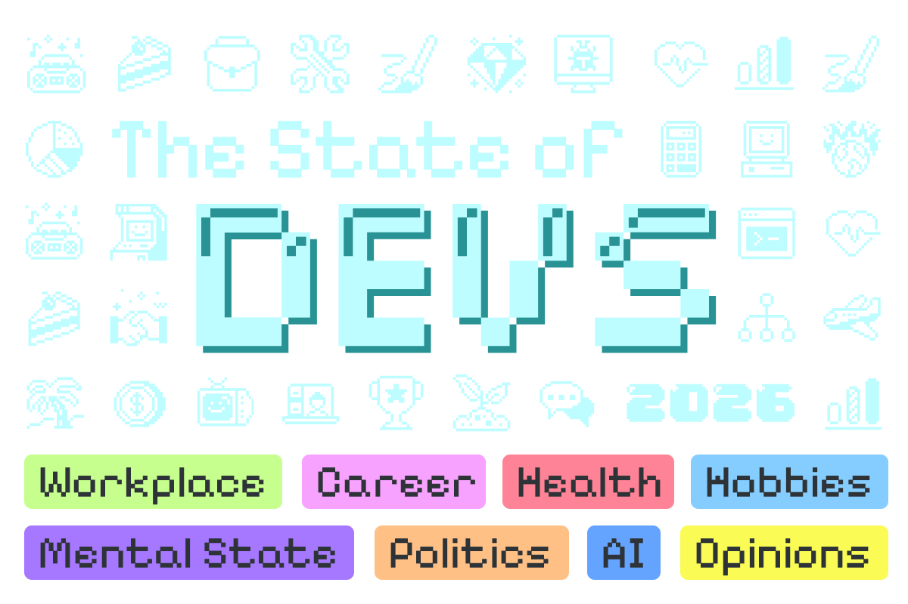

# Worked examples

A companion to [product_theming.md](product_theming.md): that document has the
rules, this one has three whole skins, each from the prompt that started it to
the problems it ran into. All of them dress products that do not exist, and none
ships with Agama: what is worth keeping is the account, not the color values.

They are deliberately different cases. Blue Sombrero starts from a published
brand with a palette and a typography pairing. Phosphor 86 starts from two
pictures and a mood, which is the harder case and the one that fights more.
Pixel Leap 26 starts from a single poster, whose colors are all backgrounds
sitting under dark text, where a skin needs them as text and icons sitting on a
surface, and from a typeface with metrics of its own.

None of them was written in one pass. Each section below ends with what came back from
looking at the running installer, which is the part no checklist produces.

The first two prompts sit on top of the template and add only what their brief
needs, with one exception: each opens the rule about not working around the role
set, quoted from the template rather than reworded, since it is what decides the
outcome when a brief meets a limit. Anything else the template says applies to
them too and is not repeated there, so a change to the template does not leave
those two stale.

The third is printed whole, because by then the template had absorbed everything
the first two had to be told mid-flight, and reading one filled prompt end to end
shows what that adds up to.

## Example 1: a published brand

**The brief.** Dress a fictional enterprise product in the official Fedora
Project brand, borrowed as a nod to the project whose PatternFly design system
Agama builds on. Use the palette as published wherever the checklist allows it,
and do not invent brand colors.

**The prompt**, on top of the template in
[product_theming.md](product_theming.md#prompting-an-ai-to-do-this):

> Create a product skin for `BlueSombrero` using the official Fedora brand
> palette and typography: main colors Dark Fedora Blue `#294172`, Fedora Blue
> `#3c6eb4`, New Fedora Blue `#51a2da`, Freedom Purple `#a07cbc`, Friends
> Magenta `#db3279`, Features Orange `#e59728`, First Green `#79db32`, plus the
> published tints, the neutrals, and the color-blind safe values. Open Sans for
> body text, Montserrat for titling.
>
> Use the product's own colors verbatim wherever the checklist allows it. Where a
> published color is too light for a white button label, keep the color and make
> the label dark instead of inventing a darker brand. Where neither label passes,
> use the tool's same-hue darkened shade and say so.
>
> Prefer the published color-blind safe values whenever two statuses would
> converge under protanopia or deuteranopia.
>
> Montserrat is not bundled by Agama, so the skin carries it: declare an
> `@font-face` pointing next to the stylesheet, and note in a comment that a real
> product ships the file from its own package.
>
> Leave corner radius, sizes and spacing unset: this skin shows what a product
> gets for free.
>
> **If something can't be done with the current `--agm-t--*` role set, don't
> get creative.** Do not set a raw PatternFly token or component-variable
> override from the product CSS file, and do not work around the "products
> only set `--agm-t--*` roles" contract. Stop and present a plan for
> extending the shared token API instead, and get that plan approved before
> writing any code.

**What fought back.**

- **The lighter blue is unreadable as text.** `#51a2da` measures 2.79:1 on white,
  so it stays a dark-theme status and the light theme takes the same hue down
  until it clears AA. Every other status got the same treatment, with the source
  brand color named in a comment beside it.
- **The dark theme had to be invented.** The brand publishes tints and shades,
  not dark surfaces, and inverting the light theme turned the blues gray. Dark is
  a night-blue page, the Dark Fedora Blue hue taken down to page darkness, with
  the published light tints as ink.
- **The tooltip is inverted rather than elevated.** On a page that dark, a
  slightly lighter tooltip leans on its shadow to be seen. Near white with dark
  text instead.

**What it left alone**, which is the point of this example: corner radius, the
size scale, spacing, icon sizes. A product that sets colors, a logo and a font
family gets a coherent installer, and that is most products.

## Example 2: a mood, not a brand

**The brief.** A retro terminal look for a fictional product, drawn from two
reference images rather than a brand guideline.

**The prompt**, again on top of the template:

> Create a product skin for `Phosphor86` using this brand: a retro terminal look,
> drawn from these two references:
> `https://www.scummvm.org/data/screenshots/dreamweb/dreamweb/dreamweb_dos_en_1_10_full.png`
> (a DOS-era phosphor-green terminal: green text and a thin green frame on a dark
> casing) and
> `https://png.pngtree.com/background/20210712/original/pngtree-retro-cyberpunk-style-80s-sci-fi-futuristic-with-laser-grid-background-picture-image_1177895.jpg`
> (an 80s neon grid: deep indigo fading to maroon, magenta and yellow neon
> lines). Read the images themselves rather than working from their descriptions,
> and decide what role each one plays before picking values.
>
> This look is natively dark, so give each theme its own premise rather than
> inverting one into the other, and say what the premises are.
>
> The look is monospace and square-cornered, so it also touches the typography,
> radius and logo roles. If it needs a typeface Agama does not bundle, the skin
> carries it.
>
> **If something can't be done with the current `--agm-t--*` role set, don't
> get creative.** Do not set a raw PatternFly token or component-variable
> override from the product CSS file, and do not work around the "products
> only set `--agm-t--*` roles" contract. Stop and present a plan for
> extending the shared token API instead, and get that plan approved before
> writing any code.

The last paragraph earned its place immediately: it turned "make the buttons
bigger" into a plan for a new role rather than a PatternFly token set behind the
contract's back. That plan is still pending, so control labels in this skin read
smaller than the text around them.

### The decisions the images do not make

- **Premises.** Dark is the screen: phosphor green on deep indigo, a green border
  as the CRT frame, magenta as the accent. Light is the printout of that session:
  dark green ink on warm paper, a printed rule as the border, the same magenta,
  so the two are recognizably one product.
- **Elevation.** The indigo needs lighter steps above the page, not the darker
  ones a "terminal" instinct suggests.
- **Statuses.** The reference indicator lights are decorative; the status roles
  are functional. They keep conventional hues tuned to the palette, so a danger
  alert still reads as danger.
- **Disabled text.** In dark it drops the green entirely: a dimmer green reads as
  "quieter text" rather than as disabled.

### What fought back

**Borders taken from a photograph.** Two measured 1.69:1 and 1.51:1, which is
roughly invisible: a picture has no idea how faint its own lines are. A third
passed on the page (3.20:1) and failed on the raised surface behind the masthead
(2.82:1), which is why a border is measured against every surface it can land
on.

**A tooltip that passed and could not be seen.** Darker than the page, as a
terminal tooltip wants to be, on a page already close to black: only its shadow
separated it from what it covered. It is inverted now, phosphor green on indigo.
No WCAG criterion covers surface-to-surface separation, so a checklist cannot
make this call.

**Two status pairs that merge for some readers.** Deuteranopia put the neon pink
danger on the phosphor green success; protanopia collapsed the light theme's red
and green onto one hue at nearly one lightness. Danger moved to vermilion
(`#ff8f66`), light success went darker (`#07502c`). One weak pair stays on
purpose: spreading the info blue from the success green under tritanopia pushed
it into the magenta accent under deuteranopia, which is commoner.

**A status color that collided with the link color.** Links were the reference's
neon yellow, which is also the caution color, and overview headings are links: an
icon signalling an issue rendered in exactly the color of the heading beside it.
Links moved to the magenta accent and the icon color role followed, so an icon
and its heading read as one item while status icons keep their own color.

**A dark theme that measured elevated and looked flat.** The ratios called the
themes comparable (light 1.13 and 1.08, dark 1.10 and 1.18); absolute luminance
separated the light surfaces by 0.113 and 0.078 against 0.006 and 0.010 in dark.
The dark steps went up to `#241b4d` and `#32285f`, pushing the custom status onto
a lighter magenta to keep 4.5:1 on a floating surface.

**A pixel typeface that had to be talked down to headings.** For running text in
a translated installer it breaks down: one weight, so emphasis has nothing to
render with; strokes that fall apart at fractional sizes; coverage stopping
around Latin, so a screen switches faces mid-sentence. Headings are short, large
and few, which is the budget it fits:
[Sixtyfour](https://fonts.google.com/specimen/Sixtyfour) for those,
[Cutive Mono](https://fonts.google.com/specimen/CutiveMono) for running text,
both shipped with the skin under the SIL Open Font License, with ordinary screen
monospaces behind them and for data such as device names.

**Font sizes, which took the longest.** Two faces at one nominal size are not the
same size: the pixel face fills most of its em, the typewriter face has a small
x-height. Raising the whole size scale is wrong twice over: it moves every text
in the UI for one font, and it brings width along, since scaling a monospace up
25% widens every line by 25% and the summary columns run out first. The scale
went back to Agama's values and each face carries its own `size-adjust`, set from
cap heights and checked against the longest sentence in the UI.

Nothing in the prompt above warned about any of that. The template asks for
`size-adjust`, cap heights and advance widths because this is where it learned
to, and the prompt is left as it was sent rather than backfilled with the answer.

### What was Agama's fault, not the skin's

A skin that pairs two visibly different families and moves the icon color off the
body text color makes assumptions visible that a default skin hides. This one
turned up several, all fixed in Agama rather than worked around in the file: a
breadcrumb trail rendering in two typefaces because only its last item is a
heading, a summary icon stranded on its own line when a long title wrapped, and
two icons in the same row coming from different components at different sizes.

Worth knowing when writing a skin: if something looks wrong and no role explains
it, the markup may be the reason. Report it rather than bending the skin around
it.

## Example 3: colors that were meant to be backgrounds

**The brief.** Dress a fictional product in the artwork of the
[State of Devs 2026](https://survey.devographics.com/es-ES/survey/state-of-devs/2026)
developer survey: pixel icons on charcoal, a pale cyan wordmark and a row of
pastel category chips. Read the result as a retro terminal rather than as a
poster, and set it in [Departure Mono](https://departuremono.com/), a monospaced
pixel face.



The poster is the survey's own artwork
([original](https://assets.devographics.com/surveys/devs2026.png)), reproduced
here as the brief the skin was drawn from.

**The prompt**, as it was run. It is longer than the two above because it is the
template in [product_theming.md](product_theming.md#prompting-an-ai-to-do-this)
with everything those two skins had to be told mid-flight already folded in:

> Work inside a checkout of the Agama sources. If you are not in one, clone
> https://github.com/agama-project/agama and work there: the files named below
> are how you find the current role set, and answering from memory instead
> produces a stylesheet that looks plausible and sets roles that do not exist.
>
> Create a product skin for `PixelLeap26` using this brand: the State of Devs
> 2026 developer survey, <https://stateofdevs.com/>. Its poster is pixel art on
> charcoal `#212424`, with a mint `#bdfdff` wordmark and eight pastel category
> chips carrying charcoal text: lime `#c7ff8f`, pink `#f9a3ff`, coral
> `#ff8396`, sky `#86cdff`, purple `#a678ff`, orange `#ffc086`, blue `#619df3`,
> yellow `#fafc55`. Treat mint as the brand color and the chips as the source
> for statuses, links and the focus ring. Read the brand as a retro terminal
> rather than as a poster: monospace everywhere, square corners, mint text on a
> dark casing, a prompt caret for a logo. The poster supplies the palette and
> the pixel grid, the terminal supplies the layout attitude. The skin file is
> `web/src/assets/products/PixelLeap26.css`; a name that does not match loads
> nothing and says nothing about why.
>
> First read `web/src/assets/products/example.css`, `example-advanced.css`,
> `Phosphor86.css` (the closest neighbour in spirit: monospace, square, dark),
> and the role-index comment at the top of
> `web/src/assets/styles/tokens/_semantic.scss`, so you know the current
> `--agm-t--*` role set rather than assuming it. A product file only ever sets
> these roles; never a raw PatternFly or component-level variable directly.
>
> Set only the roles the brand actually needs. Every role left unset keeps
> Agama's own value, so a skin that sets colors, a logo and a font family is a
> finished skin. Reach for the size, radius and spacing roles only where the
> brand genuinely differs, and say why when you do. Here the brand does differ
> on radius: the poster is pixel art with square chips and square icon strokes,
> so a zero or near-zero radius is defensible, and pixel type wants generous
> letter-spacing rather than a bigger size scale.
>
> Some things no skin controls, so do not spend effort there: the high contrast
> theme belongs to PatternFly and a skin may brand its accent and nothing else,
> line height has no role, and Cyrillic, Georgian, Chinese, Japanese and Korean
> get their family assigned per language, so a skin's typeface does not reach
> them.
>
> Every pair you set has to clear WCAG AA: 4.5:1 for text against the background
> it sits on, 3:1 for borders, icons, focus indicators and anything else that is
> not text. That is the bar whether or not you can open the files named here.
>
> Read `doc/product_theming.md` for which pairs to check, and compute each one
> explicitly with
> `web/scripts/check-contrast.js <foreground> <background> [--target=4.5]`
> (run from the repo root; `--target=3` for the non-text ones), in both light
> and dark theme separately, rather than eyeballing. Measure every row of the
> checklist, especially the ones easy to skip: statuses against the raised and
> the floating surface as well as the page, borders against all three, and the
> focus ring against the surface around it, with
> `--agm-t--focus--separator--color` carrying the contrast against the fill
> rather than the ring itself. Where a brand color fails, use the tool's
> suggested same-hue/saturation shade rather than an unrelated substitute.
> Raised and floating surfaces read lighter than the page in dark mode, not
> darker; the tooltip roles are a separate call, see the elevation notes in the
> document. Report the numbers you measured as a table.
>
> The chip pastels are tuned for charcoal text on a colored chip, which is the
> opposite of how Agama uses a status color (colored text and icons on a
> surface). Expect several of them to fail in the light theme at their published
> value and to need a darker shade of the same hue there.
>
> Keep the five status colors distinguishable from each other, not only from
> their background, and do not collapse them into the brand color: they carry
> meaning that color alone must not be responsible for. Simulate protanopia and
> deuteranopia over the five and report the closest pair. Also check them
> against the brand, link and focus colors: a status that matches the link color
> disappears where the two meet, such as an issue icon beside a heading that is
> a link. Where they collide, move the brand side, not the status. The mint
> brand color and the sky chip sit close in hue, so watch the link/info pair in
> particular.
>
> For surfaces, report the absolute relative luminance of page, raised and
> floating, not only their ratios: near black the same ratio means far less
> separation than near white, so a dark theme can clear "lighter than the page"
> and still read as one flat field. `#212424` is a light-ish charcoal rather
> than a true black, which leaves room above it; use it. Compare the separation
> you get in dark against the one you get in light, and say whether elevation or
> the border is carrying the edges.
>
> This brand is natively a dark look, so design the light theme as its own thing
> rather than inverting the dark palette, and say what premise you gave each
> theme.
>
> Typography: use Departure Mono (<https://departuremono.com/>, SIL OFL,
> monospaced pixel font). Keep the roles in relative units, check the result at
> 200% zoom and at 1024x768, and make sure the family covers the languages the
> UI is translated into (a Latin-only face switches faces mid-sentence: state
> which scripts Departure Mono actually ships, Greek included, rather than
> assuming). Name a family only when it is reachable (bundled by Agama,
> installed on the system running the browser, or shipped with the skin), always
> with fallbacks after it, and never add font files to Agama itself as part of a
> skin. Departure Mono is not bundled by Agama today, so say explicitly how the
> skin reaches it and what the fallback stack renders when it does not.
>
> Do not raise the size scale to compensate for a font that looks small or
> large. Use `size-adjust` on its `@font-face`, computed from the ratio of cap
> heights against a normal text face, and report both the cap heights and the
> advance widths you measured. Advance width is the constraint that bites: a
> body face scaled up widens every line by the same factor, so check the longest
> sentence in the UI and the narrowest column before settling on a value. A
> single-weight face means synthesized bold; say so rather than discovering it
> later. Also report what the site's "font sizes in multiples of 11px" advice
> means for a skin that has to stay in relative units, and whether the pixel
> grid survives at 200% zoom.
>
> An icon is not automatically the color of the text it labels. If you change
> the icon color role, check it against both headings and status icons.
>
> For the logo: a light and a dark SVG with a transparent background, named
> `PixelLeap26.svg` and `PixelLeap26-dark.svg` (after the product's `icon:`
> field). Draw it as pixel art on the same grid as the poster icons, in mint on
> transparent for the dark file and in a charcoal-safe shade for the light one.
> Read `ProductLogo` and its callers first to find the actual rendered size each
> usage needs, keep the aspect ratio roughly square so the logo survives all of
> them, and center the drawing inside the viewBox, since the UI aligns the image
> box and not the ink. A pixel grid does not scale to arbitrary sizes cleanly:
> pick a cell count that divides the real consuming sizes, and say which one.
> Validate the SVG with `xmllint --noout` and a rendered preview at the real
> consuming size, in both themes, before calling it done.
>
> **If something can't be done with the current `--agm-t--*` role set, don't get
> creative.** Do not set a raw PatternFly token or component-variable override
> from the product CSS file, and do not work around the "products only set
> `--agm-t--*` roles" contract. Stop and present a plan for extending the shared
> token API instead: the new role's name, where it gets documented (a role-index
> comment in `_semantic.scss`) and resolved (a PF global token in
> `_semantic.scss`, or a component-level override in
> `_patternfly-overrides.scss`, with the current Agama value as the fallback
> default so leaving it unset changes nothing), a worked example added to
> `example-advanced.css`, and whether PatternFly actually splits the underlying
> concern into several independent tokens under the hood (check before assuming
> one override reaches everywhere it should). Get that plan approved before
> writing any code. Letter-spacing and `image-rendering` are the two likely
> candidates for this brand: if no role covers them, ask, do not improvise.
>
> Finally, list what you could not verify yourself, so it can be checked in the
> running installer. Be specific: "the product list with the pixel logo at its
> real size", "a tooltip over a busy screen", "the overview at 1024x768",
> "the Greek and Cyrillic translations mid-sentence", not "please review".

### The decisions the poster does not make

- **Premises.** Dark is the terminal: the poster's own charcoal, the chips as
  statuses, the poster yellow as the focus ring. Light is that poster printed:
  paper, dark teal ink, the chip hues taken down to printing inks.
- **How much of the wordmark color.** A whole screen set in `#bdfdff` is a glare
  rather than a terminal. Running text is that cyan dimmed to `#b7ebed`, a cool
  near-white at paragraph length, and the full value stays on the logo, links,
  icons and primary fills. The poster does the same: saturated color in small
  areas against a large calm field.
- **The logo.** An 8x8 pixel prompt caret, `>_`, drawn on the same grid as the
  poster icons: cyan on transparent for dark, ink teal for light. It is the one
  place the terminal reading beats the poster reading outright.
- **What stayed unset.** The size scale, the icon sizes and the spacing roles.
  Only radius (zero, because a pixel grid has no rounded corners), the families
  and the logo sizes were touched beyond color.

### What fought back

**Colors that sit under text, needed on top of it.** Every chip on the poster is
a background under charcoal text, while a status is colored text or an icon on a
surface. The pastels survive that inversion in dark and none survives it on
paper, where the cyan measures 1.1:1 on white. Light is the same hues at ink
strength (`#005f64` brand, `#0064b0` `#8f4d00` `#c0223a` `#15683a` `#6a3ce0`
statuses): a different palette wearing the same hues, not an inverted one.

**Two status pairs that merged.** The sky chip landed 0.083 from the purple under
deuteranopia, so info moved to a lighter tint of it (`#a8dcff`), taking the pair
to 0.189. The poster yellow and the lime green share a simulated luminance under
protanopia, so caution took the orange chip and yellow became the focus ring,
0.228 or more from every status. In light, the poster pink as a ring landed 0.045
from the info blue, so focus became the brand teal: the brand side moves, never
the status.

**A focus ring that vanished on its own button.** The yellow ring measures
14.24:1 on the page and 1.02:1 against the cyan brand fill, which is what
`--agm-t--focus--separator--color` exists for: the charcoal hairline reads
13.90:1 against the fill and 14.24:1 against the ring.

**A dark theme with room to spare.** The poster charcoal is a light-ish black, so
the surfaces stack at 0.0171, 0.0297 and 0.0450 relative luminance against
0.9467, 0.8285 and 1.0000 in light: an order of magnitude less separation, so the
border carries the edges in dark while elevation only supports it. Ratios alone
would have called the two themes comparable.

**A typeface that reads large, not small.** Departure Mono fills 0.727em with its
capitals against 0.700em for the SUSE families it replaces, so `size-adjust` goes
down rather than up: 96%, which also brings the advance from 0.636em to 0.611em,
under two percent wider than the bundled monospace, so the longest strings keep
the room they have. One weight, so bold is synthesized and headings stay at 400.
Latin, Greek and Cyrillic keep the translated UI in one face; its own advice of
11px multiples is unreachable from relative units, so the pixel grid is resampled
rather than exact.

## Verifying any of them

Contrast first, with the checker rather than the eye:

```
web/scripts/check-contrast.js <foreground> <background> [--target=4.5]
```

Every row of the checklist in [product_theming.md](product_theming.md), in light
and dark separately. Then the running installer, because that is where the
remaining half lives: see the iteration loop in
[product_theming_packaging.md](product_theming_packaging.md), which needs no
rebuild between changes.

What to look at, in light, dark and high contrast:

- the product selection page and the masthead, where the logo sizes show,
- a form with an invalid field, for the danger color and the focus ring,
- a long storage table, for text size and truncation,
- a modal dialog, a menu and a tooltip, for the floating surfaces,
- toast and inline alerts, for all five statuses next to each other,
- a progress screen, for the accent on large surfaces.

Contrast numbers are necessary and not sufficient. A skin is done when someone
has looked at it.
