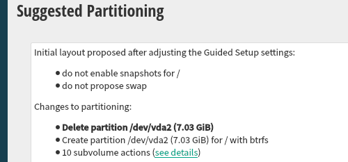

# Storage considerations

This document describes several aspects of Agama's approach to storage configuration.

All the user-facing information has been moved to the
[repository](https://github.com/agama-project/agama-project.github.io) containing the Agama
documentation. This document is maintained here for the following purposes.

  - Document the rationale behind some design decisions.
  - Recap implementation details or other information that is too technical for user-oriented
    documents.
  - Record aspects that are still under discussion.

## Agama and YaST

This section describes some of the main differences between the Agama and YaST approaches.

### Volumes in the YaST Proposal

The YaST proposal heavily relies in the concept of the so-called volumes. Those volumes, that are
different for every product or system role, describe the partitions or LVM logical volumes to be
created during the process.

In YaST, every volume specifies two different kinds of lower size limits. The so-called "desired
size" that is the smallest size that is recommended for a normal usage of that volume and the "min
size" that is the lower threshold for the volume to be minimally useful. On top of that, every
volume has a "weight", used to adjust how the available space is distributed among the volumes.

On the other hand, the maximum size for a given volume can be configured with the optional "max
size". But that value can be overridden if LVM is used by the also optional "max size LVM".

Experience has shown that people in charge of defining the volumes for each product struggle to
grasp the concepts of desired size, min size and weight. The flexibility and level of customization
they provide doesn't seem to pay off for the confusion they introduce.

Volumes at Agama will only have a minimum size and (optionally) a maximum one. No "desired size",
"weight" or "max size LVM".

### The Initial Proposal

Currently YaST tries really hard to present an initial proposal to the user, even if that implies
several subsequent executions of the `GuidedProposal`, each of them with a less ambitious
configuration. For that it relies on two features of the so-called volumes.

- First of all, every volume specifies both a "min size" and a "desired size".
- On the other hand, some features of a volume are marked as optional in the control file. That
  includes the usage of snapshots, the ability to expand based on the RAM size or even the existence
  of the volume at all.

YaST performs an initial execution of the `GuidedProposal` using the desired sizes as starting point
and with all the optional features set at their recommended values. If that fails, it runs
subsequent attempts until a proposal is possible. For that it fall-backs to the min sizes and
disables volumes (or volume features) in the order specified in the control file. It also explores
the possibility of using the different disks found on the system.

That behavior almost guarantees that YaST can make a storage proposal so it's possible to install
with an empty AutoYaST profile or by simply clicking "next, next, next" in the interactive
installer. But it is not very self-explanatory. To somehow explain what happened, YaST shows a
sentence like these next to the result of the current proposal:

- "_Initial layout proposed with the default Guided Setup settings_"
- "_Initial layout proposed after adjusting the Guided Setup settings_" (see screenshot).



As mentioned before, Agama doesn't need to replicate all YaST behaviors or to inherit its
requirements and expectations. It's possible to adopt the same approach or to go all the way in the
other direction. At this moment, Agama tries to execute the storage proposal with:

  - A single device as target.
  - The default product strategy for making space (eg. wiping the content of the disk).
  - Using the default settings for all volumes.

Agama performs until 5 attempts by using different target devices. If the system contains any BOSS
device, then the installation is tried only over such kind of devices. Otherwise, the proposal
attempts are performed over software RAIDs first and drives later. Some devices (both, software
RAIDs and drives) are not used if they are not considered as bootable device. In the case of
software RAIDs,  Agama relies on some historical YaST heuristics to consider the device as bootable.
Finally, the removable devices (e.g., USB devices) are used as last resort.

### Reusing LVM Setups

For historical reasons, YaST tries to reuse existing LVM volume groups when making a proposal. That
behavior can be very confusing in many situations. To avoid the associated problems, the Agama
storage proposal will not automatically reuse existing LVM structures.

To reuse existing volume groups the user must explicitly specify that. See the section "future
features".

## Agama and AutoYaST

The relationship between the Agama storage schema and the old AutoYaST format is described
at a [separate document](./autoyast_storage.md).

## Calculating the omitted size of a file system

If the size is omitted for a new device that directly contain a `filesystem` entry with a mount
point, Agama will then use the settings of the product to set the size limits. From a more
technical point of view, that translates into the following:

 - If the mount path corresponds to a volume supporting `auto_size`, that feature will be used.
 - If it corresponds to a volume without `auto_size`, the min and max sizes of the volumes will be
   used.
 - If there is no volume for that mount path, the sizes of the default volume will be used.
 - If the product does not specify a default volume, the behavior is still not defined (there are
   several reasonable options).

## Planned features

This section of the document recaps features and subsections of the schema that are planned but
still not implemented. Moved away from the user documentation to avoid confusion.

### Missing sections

The final plan is to offer this schema for the `storage` section.

```
"storage": {
  "drives": [ ... ],
  "volumeGroups": [ ... ],
  "mdRaids": [ ... ],
  "btrfsRaids": [ ... ],
  "nfsMounts": [ ... ]
  "boot": { ... }
}
```

So it will be possible to define (or reuse) multi-device Btrfs file systems using the future
`btrfsRaids` section.

```
{
  "alias": "...",
  "search": { ... },
  "dataRaidlevel": "...",
  "metaDataRaidLevel": "..." ,
  "devices": [ ... ],
  "label": "...",
  "mkfsOptions": { ... },
  "subvolumePrefix": "...",
  "subvolumes": [ ... ],
  "snapshots": ...,
  "quotas": ...,
  "delete": ...
}
```

And NFS shares could be mounted as entries at `nfsMounts`.

```
{
  "alias": "...",
  "path": "...",
  "mount": "..."
}
```

### Searching existing devices

The ability to select one or several existing devices using a `search` section is still on its early
stages. The following example shows how several `search` sections could be used in the future to
find the three biggest disks in the system, delete all Linux partitions bigger than 1 GiB within
them and create new partitions of type RAID. That includes features not implemented yet like the
`and` operator and the usage of `sort` to order the matching devices.

```json
"storage": {
  "drives": [
    {
      "search": {
        "sort": { "size": "desc" },
        "max": 3
      },
      "partitions": [
        {
          "search": {
            "condition": {
              "and": [
                { "partition_id": "linux" },
                { "size": { "greater": "1 GiB" } }
              ]
            }
          },
          "delete": true
        },
        {
          "alias": "newRaidPart",
          "id": "raid",
          "size": { "min": "1 GiB" }
        }
      ]
    }
  ]
}
```

Devices are matched in the order the sections appear on the profile. The usefulness of that will
increase once `sort` is implemented. It will be possible to use `sort` to select the biggest disks
like in the following example.

```json
"storage": {
  "drives": [
    {
      "search": {
        "sort": { "size": "desc" },
        "max": 1
      },
      "alias": "biggest"
    },
    {
      "search": {
        "sort": { "size": "desc" },
        "max": 1
      },
      "alias": "secondBiggest"
    }
  ]
}
```

If `search` is omitted for a drive, it will be considered to contain the following section.

```json
{
  "search": {
    "sort": { "name": "asc" },
    "max": 1,
    "ifNotFound": "error"
  }
}
```

The attribute `ifNotFound` can be used to control what happens if nothing matches a certain
`search`. In the future the value "create", which will never work drives, will cause the `search`
section to be ignored if no device matches. As a consequence, a new logical device (partition, LVM,
etc.) will be created.

### Specifying or omitting the size of a device

If the size is omitted for a device that will be created, Agama will determine the size limits when
possible. There will be basically two kinds of situations in which that automatic size calculation
can be performed.

On the one hand, the device may directly contain a `filesystem` entry specifying a mount point.
Agama will then use the settings of the product to set the size limits. That's already implemented.

On the other hand, the size limits of some devices can be omitted if they can be inferred from other
related devices following some rules.

- For an MD RAID defined on top of new partitions, it is possible to specify the size of all the
  partitions that will become members of the RAID but is also possible to specify the desired size
  for the resulting MD RAID and then the size limits of each partition will be automatically
  inferred with a small margin of error of a few MiBs.
- Something similar happens with a partition that acts as the **only** physical volume of a new LVM
  volume group. Specifying the sizes of the logical volumes could be enough, the size limits of the
  underlying partition will match the necessary values to make the logical volumes fit. In this
  case the calculated partition size is fully accurate.
- The two previous scenarios can be combined. For a new MD RAID that acts as the **only** physical
  volume of a new LVM volume group, the sizes of the logical volumes can be used to precisely
  determine what should be the size of the MD and, based on that, what should be the almost
  exact size of the underlying new partitions defined to act as members of the RAID.

The two described mechanisms to automatically determine size limits can be combined. Even creating
a configuration with no explicit sizes at all like the following example.

```json
"storage": {
  "drives": [
    {
      "partitions": [
        { "alias": "pv" }
       ]
    }
  ],
  "volumeGroups": [
    {
      "name": "system",
      "physicalVolumes": [ "pv" ],
      "logicalVolumes": [
        { "filesystem": { "path": "/" } },
        { "filesystem": { "path": "swap" } }
      ]
    }
  ]
}
```

Assuming the product configuration specifies a root filesystem with a minimum size of 5 GiB and a
max of 20 GiB and sets that the swap must have a size equivalent to the RAM on the system, then
those values would be applied to the logical volumes and the partition with alias "pv" would be
sized accordingly, taking into account all the overheads and roundings introduced by the different
technologies like LVM or the used partition table type.

### Generating Partitions as MD RAID members

Right now, MD arrays can be configured to explicitly use a set of devices by adding their aliases
to the `devices` property.

In the future, the partitions acting as members could be automatically generated by simply
indicating the target disks that will hold the partitions. For that, the `devices` section will
contain a `generate` entry.

```json
"storage": {
  "drives": [
    { "search": "/dev/sda", "alias": "sda" },
    { "search": "/dev/sdb", "alias": "sdb" },
  ],
  "mdRaids": [
    {
      "devices": [
        {
          "generate": {
            "targetDisks": ["sda", "sdb" ],
            "size": "40 GiB"
          }
        }
      ]
      "level": "raid0"
    }
  ]
}
```

As explained at the section about sizes, it will be also possible to set the size for the new RAID
letting Agama calculate the corresponding sizes of the partitions used as members. That allows to use
the short syntax for `generate`.

```json
"storage": {
  "drives": [
    { "search": "/dev/sda", "alias": "sda" },
    { "search": "/dev/sdb", "alias": "sdb" },
  ],
  "mdRaids": [
    {
      "devices": [ { "generate": ["sda", "sdb" ] } ],
      "level": "raid0",
      "size": "40 GiB"
    }
  ]
}
```

The _default_ and _mandatory_ keywords could also be used to generate a set of formatted MD arrays.
Assuming the default volumes are "/", "/home" and "swap", the following snippet would generate three
RAIDs of the appropriate sizes and the corresponding six partitions needed to support them.

```json
"storage": {
  "drives": [
    { "search": "/dev/sda", "alias": "sda" },
    { "search": "/dev/sdb", "alias": "sdb" },
  ],
  "mdRaids": [
    {
      "generate": {
        "mdRaids": "default",
        "level": "raid0",
        "devices": [
          { "generate": ["sda", "sdb"] }
        ]
      }
    }
  ]
}
```

## Schema sections under discussion

This section summarizes several aspects of the Agama storage schema that have been considered
but not implemented so far.

### Specifying the Size of a Device

The current schema makes it possible to specify the sizes as a fixed value or as a range. But a
a parseable string like "40 GiB" may not be the only option to represent a size or a range limit.
The following two possibilities are also under consideration.

 - `{ "gib": 40 }`
 - `{ "value": 40, "units": "gib" }`

### Searching Existing Devices

Strings may be used as value for `search` to locate a device by its name or to search all existing
devices using "\*". But strings may be useful in other situations.

For example, "next" (or any similar term) could be used to represent the default search for drives
(which is something like `{ "sort": { "name": "asc" }, "max": 1, "ifNotFound": "error" }`.

If a simple string like "next" could be used to specify the standard search entry for drives, it
would make sense to simply make `search` mandatory for all drives instead of assuming a default one.

Another possible improvement for that string-based format would be supporting regular expressions.
That would make it possible to use searchers like this.

```json
{ "search": ".*" }
```

But regular expressions would not play well with libstorage-ng. Since not all device names are
stored in the devicegraph, it is is necessary to use functions like `find_by_any_name` in order to
perform an exhaustive search by name.

### Referencing Other Devices

In addition to aliases, a `search` section could be accepted in all the places in which an alias can
be used. In that case, the scope of the search would always be the whole set of devices in the
system (so the same conditions can be matched by a disk, a partition, an LVM device, etc.) and
`ifNotFound` could not be set to "create" (similar to what happens for drives in general).

```json
"storage": {
     "volume_groups": [
        {
            "name": "newVG",
            "physicalVolumes": [
                { "search": { "condition": { "name": "/dev/sda2" } } }
            ],
            "logicalVolumes": [ { "name": "data", "size": "20 GiB" } ]
        }
    ]
}
```
