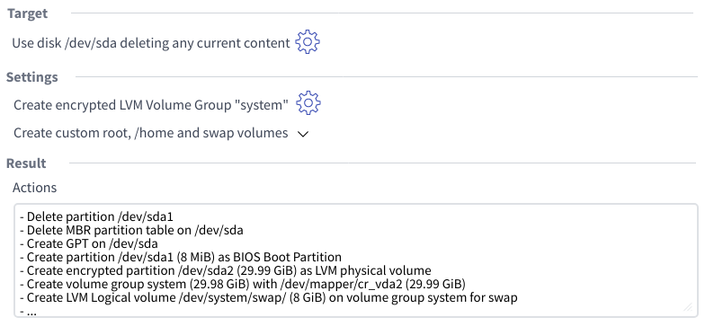
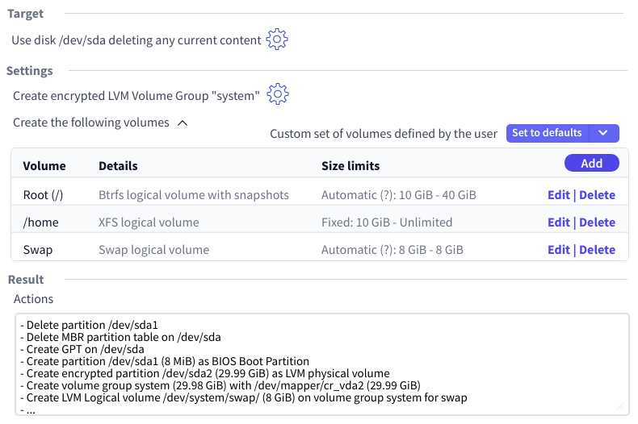
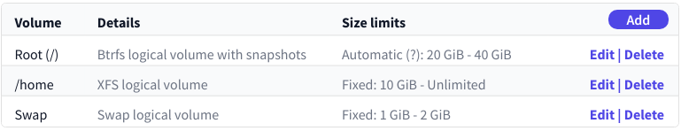
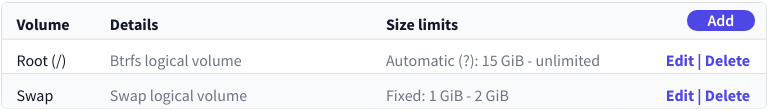

# A Proposal for the Storage User Interface

The main idea is to reuse the `GuidedProposal` mechanism implemented by YaST but following an
slightly different approach regarding the logic to delete and resize partitions (see below).

## Previous Considerations

### Don't Take Mock-ups Too Seriously

First of all, bear in mind the screenshots are far from being a faithfull representation of the
final look & feel. This document presents the concept focusing on the elements that should be there
and how they will interact. Something that is represented as a sentence in the screenshots can
become a tool-tip, a given icon can become a label, actions grouped in a drop-down can end up
being represented as separate buttons, etc.

### Representation of the Actions to Perform

Another important point to consider is that currently the list of (libstorage-ng) actions is the
only way we have to represent the result of a given proposal. That representation is far from ideal.
It doesn't offer a convenient high-level view of the final layout or of the really significant
actions (it includes too many intermediate steps by default). But designing a more convenient
representation of the result is out of the scope of this proposal. Wherever the list of actions is
presented in a workflow step or a screenshot, it's assumed that such a list will be substituted in
the future by a better alternative to show the result.

### Calculating How to Make Space

Although D-Installer reuses part of the internal logic of YaST, there is no need to reproduce all
YaST behaviors.

YaST's `GuidedProposal` contains a subcomponent called `SpaceMaker` which takes cares of deleting
and resizing existing partitions to make space for the new system. It decides by itself which
partitions should be affected following a logic that, even though is configurable in the control
file and by the UI, is hard to follow for many end users.

The proposal described in this document would not rely on that logic. Instead, D-Installer would
only propose two ways of making space:

- Completely wipe the content of the selected disk(s) and start from scratch.
- Manually select which partitions to keep / delete / resize.

### About the Initial Proposal

Currently YaST tries really hard to present an initial proposal to the user, even if that implies
several subsequent executions of the `GuidedProposal`, each of them with a less ambitious
configuration. For that it relies on two features of the so-called volumes (i.e. the specification
of the partitions or LVM logical volumes to be created during the process).

- First of all, every volume specifies two different kinds of lower size limits in the control file.
  The so-called "desired size" that is the smallest size that is recommeded for a normal usage of
  that volume and the "min size" that is the lower threshold for the volume to be minimally useful.
- On the other hand, some features of a volume are marked as optional in the control file. That
  includes the usage of snapshots, the ability to expand based on the RAM size or even the existence
  of the volume at all.

YaST performs an initial execution of the `GuidedProposal` using the desired sizes as starting point
and with all the optional features set at their recommended values. If that fails, it runs
subsequent attempts until a proposal is possible. For that it fallbacks to the min sizes and
disables volumes (or volume features) in the order specified in the control file. It also explores
the possibility of using the different disks found on the system.

That behavior almost guarantees that YaST can make a storage proposal so it's possible to install
with an empty AutoYaST profile or by simply clicking "next, next, next" in the interactive
installer. But it is not very self-explanatory. To somehow explain what happened, YaST shows a
sentence like these next to the result of the current proposal:

- "_Initial layout proposed with the default Guided Setup settings_"
- "_Initial layout proposed after adjusting the Guided Setup settings_" (see screenshot).


As mentioned before, D-Installer doesn't need to replicate all YaST behaviors or to inherit its
requirements and expectations. It's possible to adopt the same approach or to go all the way in the
other direction and try by default to execute the `GuidedProposal` only once, with:

  - A single disk as target (chosen by any criteria)
  - Wiping the content of the disk (see previous note about making space)
  - Using the desired sizes of the volumes and their default settings

If that execution of the `GuidedProposal` fails, then D-Installer could simply show a message like:
"it was not possible to calculate an initial storage layout".

The interface proposed in this document will work equally whatever approach is decided for the
initial storage proposal of D-Installer.

## General Workflow

Having all the previous considerations in mind, let's describe how the general user interaction will
work.

The summary screen of D-Installer would display the result of the current storage proposal (or a
message about the failed initial calculation) and next to it, a link to modify that layout.
That link will lead to the following interface. Note the mock-ups do not display an initial
proposal, but the status after some manual changes done by the user.



Every configuration change for any of the aspects displayed in that screen will be performed in a
pop-up. Accepting the pop-up will result in the re-calculation of the "result" section.

The first option would be to change the target device(s) of the proposal. That pop-up is not fully
defined but will allow two things:

- Select in which disk(s) to install the system. It should also allow to specify which disk is
  used as boot device.
- Specify what to do with the current content of the selected disk(s). The default option would be
  to simply wipe the full content but there should be an alternative to select explicitly which
  concrete partitions must be deleted or resized and to what extend.

Then the "settings" section will allow to configure two things: the general proposal configuration
and the list of volumes to use as a base to create partitions and logical volumes.

The general configuration includes the usage of LVM and encryption and any aspect related to those,
like the encryption passphrase. As always, that will be displayed in a pop-up and accepting the
changes will result in the recalculation of the result.

The list of volumes is collapsed by default for clarity, but expanding it would reveal the following
options.



The table allows to customize the list of volumes. The form to add or edit a given volume
would be displayed as a pop-up and every confirmed change in the list will cause a recalculation of
the result at the bottom.

The size of each volume is specified as a couple of lower and upper limits (the upper one is
optional in all cases). With the current approach of the YaST `GuidedProposal` there are some
volumes that may need to recalculate those limits based on its configuration or its relationship
with others volumes. Their limits will be set as "automatic" by default. For more details,
see the corresponding section below.

Apart from the size limits, the add/edit form for a given volume would allow to configure other
aspects like the file-system type or the usage of snapshots and subvolumes.

Last but not least, the table header includes a small description about the origin of the current
list of volumes. Maybe some additional details can be displayed with a tool-tip or maybe that small
description can be displayed by any other mechanism. Next to the description a set of two grouped
actions allow to:

- Reset the list to the default volumes using their recommended sizes (i.e. desired) as lower limit
- Same action but using the minimum sizes (i.e. min) as lower limit

The proposed workflow and interface should cover most of the basic use-cases, although further
improvements may be needed to accomodate scenarios like re-installing the system in a similar way to
the option "Import Mount Points" from the YaST Partitioner.

## Automatic Size Limits

Currently there are cases in which the lower and upper limits of a given volume are adjusted for
the `GuidedProposal` based on the following aspects:

- Whether snapshots are activated for the root volume
- Whether the size of the volume must be influenced by the RAM size (used for suspend in the case
  of swap and for Kdump in the case of the root volume)
- Whether the given volume is marked as "fallback" for another one (eg. if the separate /home is
  disabled then the upper limit of the root one dissapears)

To make that possible, the size limits of the volumes that are affected by one or several of those
circumstances will be set as "automatic" by default. If that's the case, a tool-tip will be
available next to each set of limits to explain the rationale of the current values.

Let's consider the following example in which some volumes are configured like this in the control
file of the product/role being installed:

```xml
<volumes>
  <volume>
    <mount_point>/</mount_point>
    <desired_size>5 GiB</desired_size>
    <max_size>10 GiB</max_size>
    <!-- Sizes are multiplied by 4 if snapshots are configured -->
    <snapshots_percentage>300</snapshots_percentage>
    ...
  </volume>
  <volume>
    <mount_point>/home</mount_point>
    <desired_size>10 GiB</desired_size>
    <max_size>unlimited</max_size>
    <!-- if this volume is disabled we want "/" to increase -->
    <fallback_for_desired_size>/</fallback_for_desired_size>
    <fallback_for_max_size>/</fallback_for_max_size>
    ...
  </volume>
  ...
</volumes>
```

The list could start with something like this.



The reason for the "automatic" value would be explained to the user via a tool-tip (or similar
mechanism) with a text similar to this (very crude wording, to be refined):

```
These limits are affected by::
  - The configuration of snapshots
  - The presence of a separate /home volume
```

As a consequence of all that, if the user deletes the /home volume then the new list would be (note
the change in the automatic size limits of the root volume).


If, on top of that, the user also disables snapshots the new resulting list would be.



Of course, at any point in time the user could modify the root volume and switch to fixed limits. In
that case, the entered values would be observed and would not be automatically recalculated anymore,
despite any configuration in the control file.
