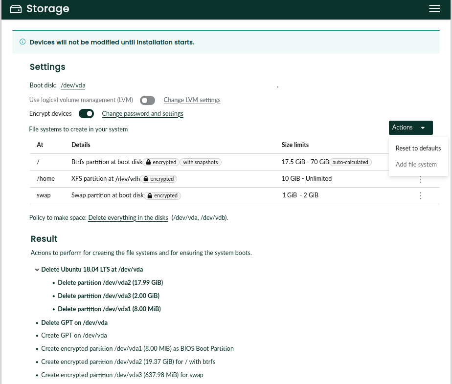
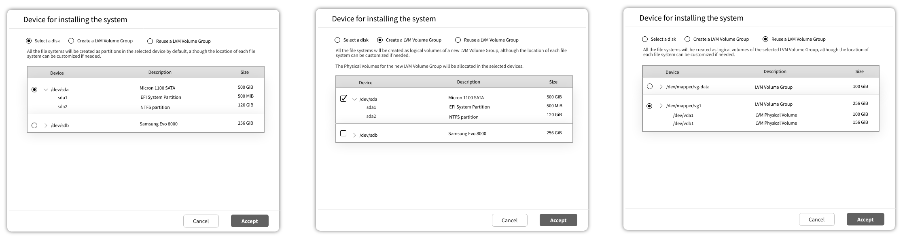
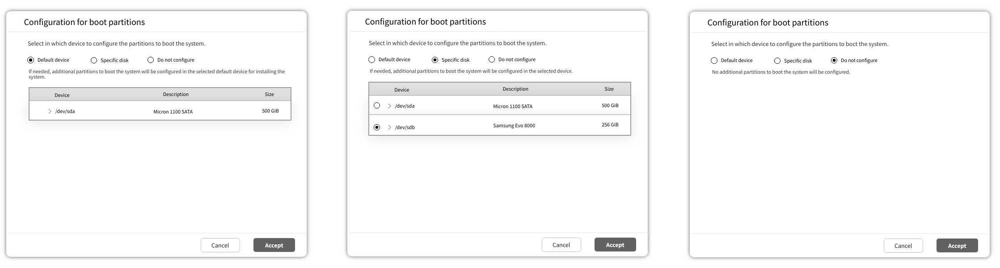
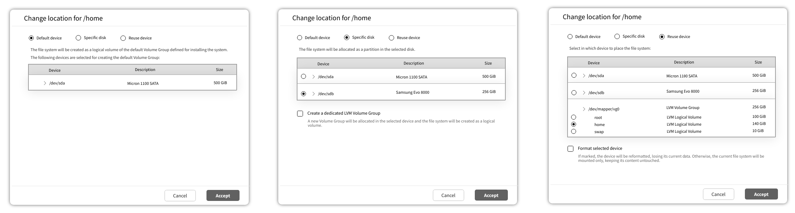
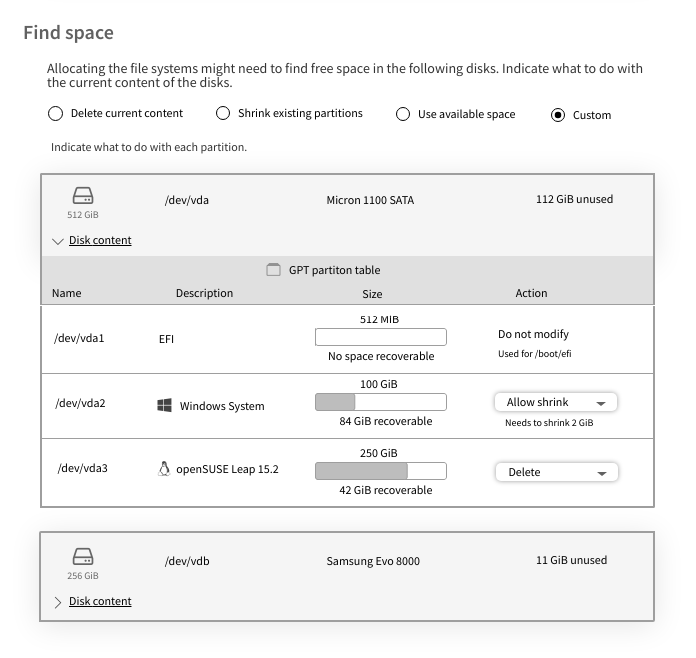
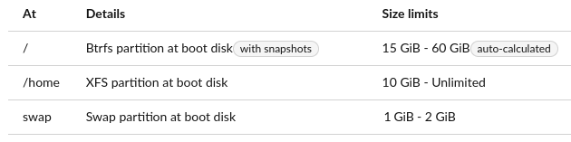
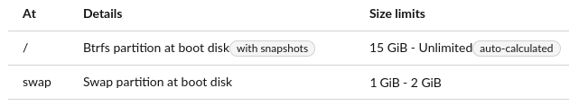
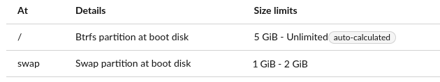
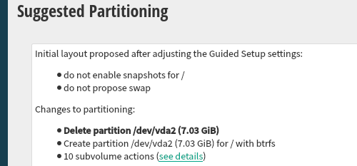

# A Proposal for the Storage User Interface

## Previous Considerations

### Don't Take Mock-ups Too Seriously

First of all, bear in mind the screenshots are far from being a faithfull representation of the
final look & feel. This document presents the concept focusing on the elements that should be there
and how they will interact. Something that is represented as a sentence in the screenshots can
become a tool-tip, a given icon can become a label, actions grouped in a drop-down can end up
being represented as separate buttons, etc.

### Representation of the Actions to Perform

Another important point to consider is that currently the list of (libstorage-ng) actions is the
only way we have to represent the result of a given proposal. That representation is far from ideal.
It doesn't offer a convenient high-level view of the final layout or of the really significant
actions (it includes too many intermediate steps by default).

A complete design for a more convenient representation of the result is out of the scope of this
proposal. Nevertheless, small changes (like grouping the actions based on the operating system
they affect) are somehow suggested in some of the upcoming sections and mock-ups.

In the long term, we may need to come with a better alternative to show the result.

## General Workflow

Having all the previous considerations in mind, let's describe how the general user interaction will
work.

The summary page of Agama would display the result of the current storage proposal (or a
message about the failed initial calculation) and a link to modify that layout. That link will lead
to the page that allows to (re)configure and (re)calculate the storage proposal and that is
described at *The Proposal Page*.

The Agama storage proposal will be the only mechanism to define the file systems of the new
operating system, including their mount points, subvolumes and options for formatting or mounting.
This proposal is based on the `GuidedProposal` implemented by the YaST libraries and presented as
"Guided Setup" in the YaST user interface. As such, the wanted file systems will actually be defined
as a set of so-called volumes very similar to the YaST ones (see *Volumes in the YaST Proposal* for
more information). The term "volume" is intentionally avoided in the user interface, using the term
"file system" instead. Nevertheless this document uses both terms indistinctly.

Sometimes a previous setup may be needed in order to prepare the devices used by that proposal
mechanism. That includes actions like connecting to some iSCSI disks, activating and formating
DASDs, creating a software-defined RAID or setting an advanced LVM layout potentially including
several volume groups or thin-provisioned volumes. Those actions will in general modify the system
right away, instead of just planning actions to be performed during installation. Access to those
preliminary actions will be available from the Agama storage page. The general functionality is
briefly described at *Advanced Preparations*.

## The Proposal Page

### Overall Description of the Proposal

The following interface will allow to configure the Agama storage setup for installation. Note the
mock-ups do not display an initial proposal, but the status after some manual changes done by the
user.



Every change to any of the configuration options will result in an immediate re-calculation of the
"planned actions" section which represents the result. Changes in the configuration of encryption,
btrfs snapshots or the target devices can also imply refreshing the description of the file systems.
In a similar way, changes in those volumes or the target device may result in some disk being
included or excluded in the section "find space".

The table with the file systems actually represents the volumes used as input for the Agama variant
of the `GuidedProposal`. Compared to YaST, Agama turns the volumes into a much more visible concept.
The users will be able to see and adjust most of their attributes. Users could even define new
volumes that are not initially part of the configuration of the selected product.

Pop-up dialogs will be used to modify the target device(s), the encryption configuration or the
booting setup, as well as to add or edit a given volume.

All file systems will be created by default at the chosen target disk or at the default LVM volume
group (in the case of LVM-based proposal). The user will be able to manually overwrite the location
of any particular volume. That has been done in the mock-up about both for the swap volume, which
will be created in an alternative disk, and for the `/home` one, that will reuse the existing file
system at the `vdb1` partition. Continue reading to understand all the possible options.

Defining the settings and the list of volumes also defines, as a direct consequence, the disks
affected by the installation process. It may be needed to make some space in those disks. That
deserves a dedicated section in the proposal page that is described below.

### Device Selection and General Settings

As seen on the image above, the main device to install the system can be chosen at the very top of
the storage proposal page. Although a Linux installation can extend over several disks, the storage
proposal algorithm and its configuration is better understood if one device is chosen as the main
target one. That device can be a single disk (or equivalent device) or an LVM volume group.



When the main target device is a disk, the volumes will be created by default as new partitions
there. If a new LVM volume group is chosen as installation device, the selection of disks indicates
which devices will be partitioned in order to allocate the physical volumes of the new volume group.
In that case, the file systems will be created by default as new LVM logical volumes at that new
volume group.

The device selection is followed by some global settings that define how the installation is going
to look and what are the possibilities in terms of booting and structuring the file systems. Those
settings include the usage of btrfs snapshots, which in YaST is presented relatively hidden as one
of the configuration options for the root file system.

One of the main features of the `GuidedProposal` is its ability to automatically determine any extra
partition that may be needed for booting the new system, like PReP, EFI, Zipl or any other described
at the [corresponding YaST
document](https://github.com/yast/yast-storage-ng/blob/master/doc/boot-requirements.md). The
algorithm can create those partitions or reuse existing ones that are already in the system if the
user wants to keep them (see the section about finding space). The behavior of that feature can be
also be tweaked in the "settings" section of the page.



### File Systems

The next section contains the table that displays the file systems to be created, volumes in YaST
jargon. The size of each volume is specified as a couple of lower and upper limits (the upper one is
optional in all cases). With the current approach of the YaST `GuidedProposal` there are some
volumes that may need to recalculate those limits based on the proposal configuration (eg. whether
Btrfs snapshots are enabled) or its relationship with others volumes. Their limits will be set as
"auto-calculated" by default. For more details, see the corresponding section below.

If btrfs is used for the root file system, it will be possible to define subvolumes for it. Those
subvolumes are represented in the same table, nested on the entry of the root file system. They can
be removed and added. The subvolume entries are collapsed by default.

If a subvolume becomes irrelevant due to the creation of another file system (let's say a `/var/lib`
subvolume exists but a new `/var` file system is added to the table), then it will not be created by
the proposal. That's known as "subvolume masking" in the YaST internals. It's still not clear how
that will be represented in the table.

Although btrfs subvolumes don't have sizes. We might consider to add support for defining btrfs
quotas. In that case, the quota could be specified for each entry taking advantage of the already
existing column "size limits", although those quotas don't really affect the size calculations
performed by the proposal.

All file systems will be created on the installation device by default. But it will be possible to
specify an an alternative location using the following form that offers several options.



When the option to reuse an existing device is chosen, size limits cannot be adjusted. The size of
the reused device will be displayed in the table of file systems in the corresponding column.

### Finding Space for the Volumes

Similar to YaST, Agama will offer by default the option to automatically make space for the new
operating system. But the algorithm will be different and less configurable, offering basically
three automatic modes.

As an alternative, the Agama proposal will offer a custom mode in which the user will explicitly
select which partitions to keep, delete or resize.

That will result in up to four possibilities presented in the corresponding section.

- Delete everything in the disk(s). Obviously, all previous data is removed.
- Shrink existing partition(s). The information is kept, but partitions are resized as needed to make
  enough space.
- Do not modify existing partition(s). The installation will only succeed if the disk(s) already
  contains suitable free spaces.
- Custom. The user interface will allow the user to specify what to do with every individual partition
  in the affected disks: delete it, keep it as it is or allow the algorithm to shrink it based on
  the needs determined by the sizes of the volumes to allocate.



If the device chosen for installation is an already existing LVM volume group (see "device selection
and general settings"), that volume group will be displayed in a very similar way to any affected
disk, making it possible to specify what to do with the pre-existing logical volumes in a way that
is analogous to partitions in a disk.

### Automatic Size Limits

Currently there are cases in which the lower and upper limits of a given volume are adjusted for
the `GuidedProposal` based on the following aspects:

- Whether snapshots are activated for the root volume
- Whether the size of the volume must be influenced by the RAM size (used for suspend in the case
  of swap and for Kdump in the case of the root volume)
- Whether the given volume is marked as "fallback" for another one (eg. if the separate /home is
  disabled then the upper limit of the root one disappears)

To make that possible, the size limits of the volumes that are affected by one or several of those
circumstances will be set as "auto-calculated" by default. If that's the case, a tool-tip will be
available next to each set of limits to explain the rationale of the current values.

Let's consider the following example in which some volumes are configured like this for the product
being installed:

```yaml
volumes:
- mount_point: "/"
  min_size: 5 GiB
  max_size: 20 GiB
  # Sizes are multiplied by 3 if snapshots are configured
  snapshots_percentage: 200
  ...
- mount_point: "/home"
  min_size: 10 GiB
  max_size: unlimited
  # If this volume is disabled we want "/" to increase
  fallback_for_max_size: "/"
  ...
```

The list could start with something like this.



The reason for the "auto-calculated" value would be explained to the user via a tool-tip (or similar
mechanism) with a text similar to this (very crude wording, to be refined):

```
These limits are affected by::
  - The configuration of snapshots
  - The presence of a separate /home volume
```

As a consequence of all that, if the user deletes the /home volume then the new list would be (note
the change in the automatic size limits of the root volume).



If, on top of that, the user also disables snapshots the new resulting list would be.



Of course, at any point in time the user could modify the root volume and switch to fixed (ie. not
auto-calculated) limits. In that case, the entered values would be observed and would not be
automatically recalculated anymore, despite any configuration for the default volumes.

## Advanced Preparations

As mentioned above, in addition to the page for defining the proposal, Agama will offer interfaces to
perform some preparatory actions like managing DASDs or setting up complex RAID or LVM layouts.
Those interfaces will never replace the storage proposal as the only way to define the file systems of
the installed system. Instead, they will operate right away in the system to configure the devices
to be used by the proposal.

Some of those interfaces already exist, like the one that allows to connect and disconnect to iSCSI
targets or the one to manage DASDs. Currently they can be reached through a special menu at the
Agama header. We may consider other mechanisms to make them more discoverable in the future.

There will also be interfaces to:

- Manage software-defined RAIDs
- Manage Bcache devices
- Define custom LVM setups
- Manipulate partitions in the disks or in any of the RAID and bcache devices

Since all those actions are interrelated (eg. the user often creates partitions that are combined
into a RAID that is then used as an LVM physical volume), the final user interface will likely
resemble the traditional YaST Expert Partitioner. But, since the scope of such a tool will be
limited to preparing the disk for the proposal, it will not allow to format devices or to define
mount points for the target system. After defining all the actions to be performed, the changes will
be committed to the system before returning to the proposal page to define the location and settings
of each file system.

## Comparison with the YaST Proposal

### Volumes in the YaST Proposal

The YaST proposal heavily relies in the concept of the so-called volumes. Those volumes, that are
different for every product or system role, describe the partitions or LVM logical volumes to be
created during the process.

In YaST, every volume specifies two different kinds of lower size limits. The so-called "desired
size" that is the smallest size that is recommeded for a normal usage of that volume and the "min
size" that is the lower threshold for the volume to be minimally useful. On top of that, every
volume has a "weight", used to adjust how the available space is distributed among the volumes.

On the other hand, the maximum size for a given volume can be configured with the optional "max
size". But that value can be overridden if LVM is used by the also optional "max size LVM".

Experience has shown that people in charge of defining the volumes for each product struggle to
grasp the concepts of desired size, min size and weight. The flexibility and level of customization
they provide doesn't seem to pay off for the confusion they introduce.

Volumes at Agama will only have a minimum size and (optionally) a maximum one. No "desired size",
"weight" or "max size LVM".

### Reusing LVM Setups

For historical reasons, YaST tries to reuse existing LVM volume groups when making a proposal. That
behavior can be very confusing in many situations. To avoid the associated problems, the Agama
storage proposal will not automatically reuse existing LVM structures.

To reuse existing volume groups the user must explicitly specify that. See the section "future
features".

### About the Initial Proposal

Currently YaST tries really hard to present an initial proposal to the user, even if that implies
several subsequent executions of the `GuidedProposal`, each of them with a less ambitious
configuration. For that it relies on two features of the so-called volumes (volumes are already
described at *Volumes in the YaST Proposal*):

- First of all, every volume specifies both a "min size" and a "desired size".
- On the other hand, some features of a volume are marked as optional in the control file. That
  includes the usage of snapshots, the ability to expand based on the RAM size or even the existence
  of the volume at all.

YaST performs an initial execution of the `GuidedProposal` using the desired sizes as starting point
and with all the optional features set at their recommended values. If that fails, it runs
subsequent attempts until a proposal is possible. For that it fallbacks to the min sizes and
disables volumes (or volume features) in the order specified in the control file. It also explores
the possibility of using the different disks found on the system.

That behavior almost guarantees that YaST can make a storage proposal so it's possible to install
with an empty AutoYaST profile or by simply clicking "next, next, next" in the interactive
installer. But it is not very self-explanatory. To somehow explain what happened, YaST shows a
sentence like these next to the result of the current proposal:

- "_Initial layout proposed with the default Guided Setup settings_"
- "_Initial layout proposed after adjusting the Guided Setup settings_" (see screenshot).



As mentioned before, Agama doesn't need to replicate all YaST behaviors or to inherit its
requirements and expectations. It's possible to adopt the same approach or to go all the way in the
other direction and try by default to execute a variant of the `GuidedProposal` only once, with:

  - A single disk as target (chosen by any criteria)
  - A simple strategy for making space (eg. wiping the content of the disk)
  - Using the default settings for all volumes

If that execution of the `GuidedProposal` fails, then Agama could simply show a message like:
"it was not possible to calculate an initial storage layout".

The interface proposed in this document will work equally whatever approach is decided for the
initial storage proposal of Agama.
