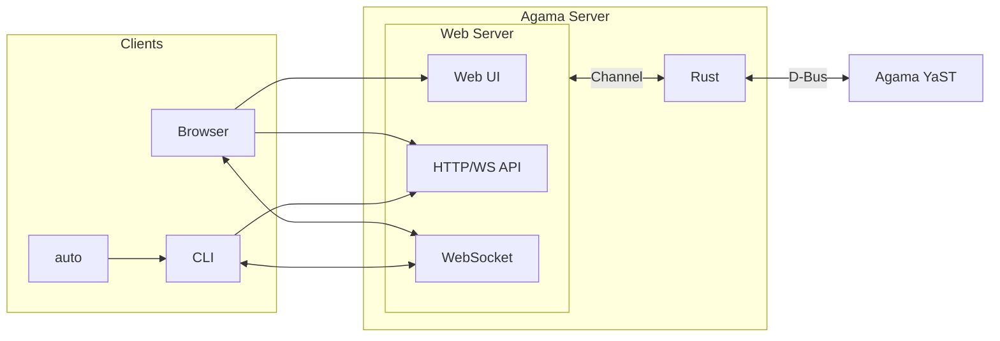

# Architecture

On the surface, Agama implements a typical client-server architecture. The server offers an
HTTP/JSON API with a WebSocket to send messages to the connected clients. The web and the
command-line interfaces, part of Agama, act as clients connecting to that server.

However, things are more complex, especially on the server side. The following diagram represents
the main components and their interactions.

With this overview in mind, let's have a closer look to each of the components.

## Server

On the server side, Agama is composed by the following pieces:

- **Agama server**: from a user's perspective, this is the core of Agama. It is responsible for:

  - Implementing (part of) the installation logic. A good share of this logic is delegated to
    **Agama YaST**.
  - Offering an HTTP and WebSocket (HTTP/WS) interface.
  - Making the **web-based user interface** available to the browsers.

- **Agama YaST service**: it is written in Ruby and has direct access to YaST libraries. This
  component implements complex parts, like storage and software handling. Communication with the
  Agama web server happens over D-Bus.

- **Agama D-Bus service**: implements a minimal API to communicate **Agama server** and **Agama YaST
  service**. It is expected to be replaced by direct communication (most likely via HTTP) in the
  future.

## Clients

On the client side, these are the main components:

- **Web user interface**: Agama's graphical user interface. The **Agama web
  server** makes this React application available to browsers.

- **Command-Line Interface (`agama-cli`)**: it allows interaction with Agama and drives the
  auto-installation process.

- **Auto-installation (`autoinstallation`)**: it is composed of a Systemd service (`agama-auto`) and
  a script that relies on `agama-cli` binary.

## Encryption

In the case of a remote installation, the communication between the clients and the server must be
encrypted. Connecting to port 80 (HTTP) redirects the client to port 443 (HTTPS).

About the certificate, Agama uses a self-signed certificate unless the user injects its own.
