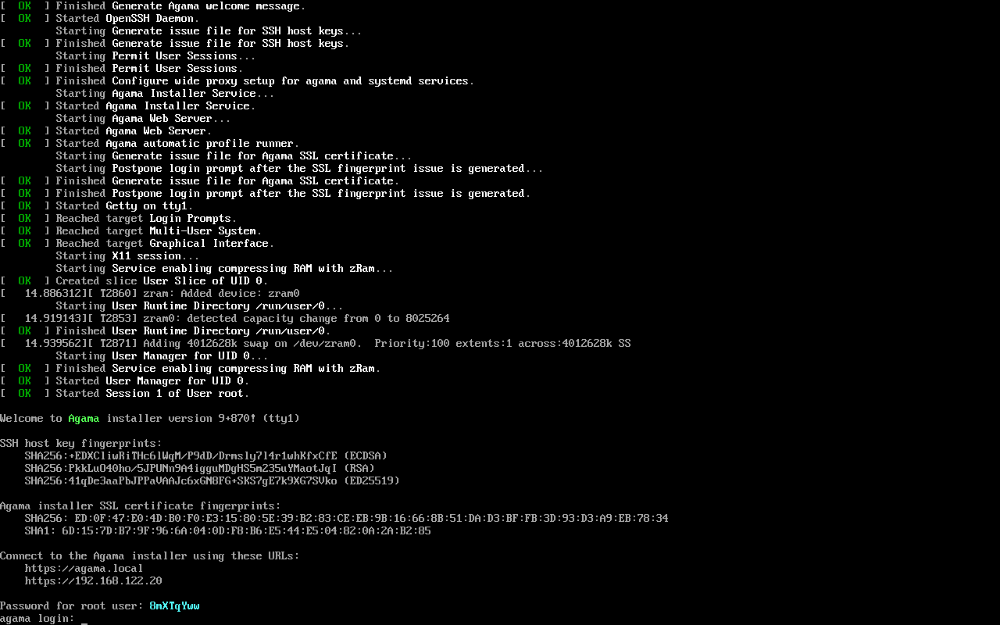

# Encryption

## HTTP vs HTTPS

If the server and the client run in the same machine, the communication can be done over HTTP or
HTTPS. However, if the server and the client are on different machines, **HTTPS is mandatory**. In
such case all HTTP requests are automatically redirected to HTTPS[^redirect].

The same applies principle applies to the WebSocket, which is encrypted in case
of remote installations.

[^redirect]: The client gets a response with code 308 (permanent redirect).

## SSL certificates

If no certificate is given, Agama uses a self-signed one to secure the communications between the
server and the clients.

Most likely, you will want to check the certificate's fingerprint to make sure you are connecting to
the right system. Agama's live medium writes the fingerprint to the console and the serial console
as you can see on the screenshot below.

:::warning
There is no easy way yet to inject your own certificate when using Agama's live medium, although the
`agama-web-server` command provides options to set the certificate and its key.
